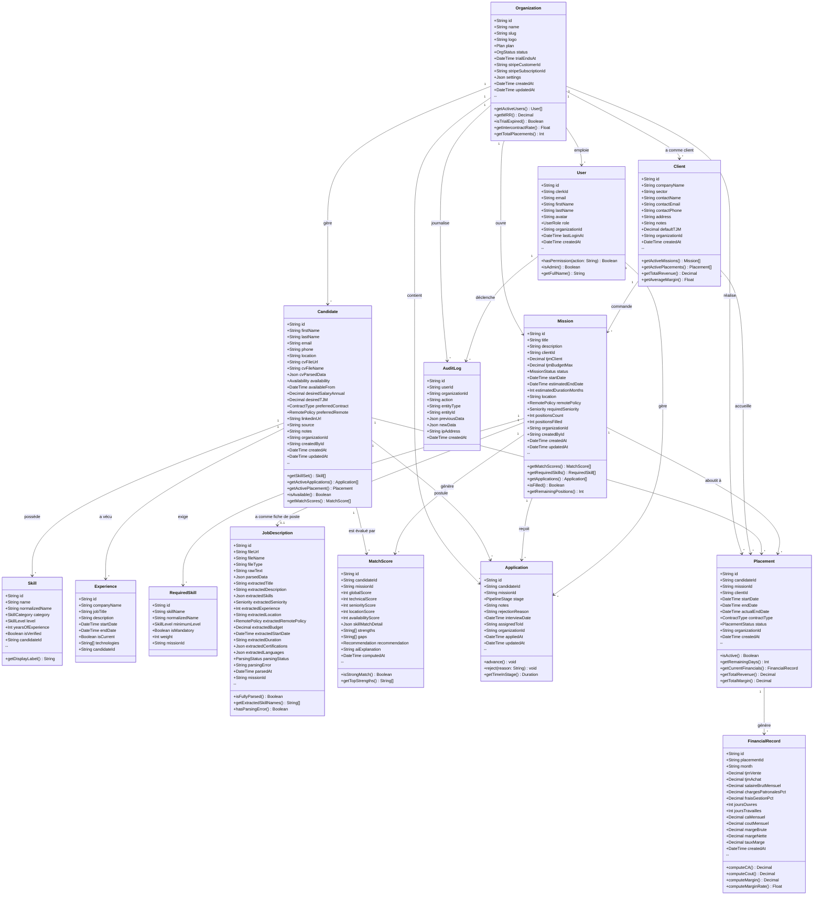

# Class Diagram

```mermaid
classDiagram
    class Organization {
        +String id
        +String name
        +String slug
        +String logo
        +Plan plan
        +OrgStatus status
        +DateTime trialEndsAt
        +String stripeCustomerId
        +String stripeSubscriptionId
        +Json settings
        +DateTime createdAt
        +DateTime updatedAt
        --
        +getActiveUsers() User[]
        +getMRR() Decimal
        +isTrialExpired() Boolean
        +getIntercontractRate() Float
        +getTotalPlacements() Int
    }

    class User {
        +String id
        +String clerkId
        +String email
        +String firstName
        +String lastName
        +String avatar
        +UserRole role
        +String organizationId
        +DateTime lastLoginAt
        +DateTime createdAt
        --
        +hasPermission(action: String) Boolean
        +isAdmin() Boolean
        +getFullName() String
    }

    class Candidate {
        +String id
        +String firstName
        +String lastName
        +String email
        +String phone
        +String location
        +String cvFileUrl
        +String cvFileName
        +Json cvParsedData
        +Availability availability
        +DateTime availableFrom
        +Decimal desiredSalaryAnnual
        +Decimal desiredTJM
        +ContractType preferredContract
        +RemotePolicy preferredRemote
        +String linkedinUrl
        +String source
        +String notes
        +String organizationId
        +String createdById
        +DateTime createdAt
        +DateTime updatedAt
        --
        +getSkillSet() Skill[]
        +getActiveApplications() Application[]
        +getActivePlacement() Placement
        +isAvailable() Boolean
        +getMatchScores() MatchScore[]
    }

    class Skill {
        +String id
        +String name
        +String normalizedName
        +SkillCategory category
        +SkillLevel level
        +Int yearsOfExperience
        +Boolean isVerified
        +String candidateId
        --
        +getDisplayLabel() String
    }

    class Experience {
        +String id
        +String companyName
        +String jobTitle
        +String description
        +DateTime startDate
        +DateTime endDate
        +Boolean isCurrent
        +String[] technologies
        +String candidateId
    }

    class Client {
        +String id
        +String companyName
        +String sector
        +String contactName
        +String contactEmail
        +String contactPhone
        +String address
        +String notes
        +Decimal defaultTJM
        +String organizationId
        +DateTime createdAt
        --
        +getActiveMissions() Mission[]
        +getActivePlacements() Placement[]
        +getTotalRevenue() Decimal
        +getAverageMargin() Float
    }

    class Mission {
        +String id
        +String title
        +String description
        +String clientId
        +Decimal tjmClient
        +Decimal tjmBudgetMax
        +MissionStatus status
        +DateTime startDate
        +DateTime estimatedEndDate
        +Int estimatedDurationMonths
        +String location
        +RemotePolicy remotePolicy
        +Seniority requiredSeniority
        +Int positionsCount
        +Int positionsFilled
        +String organizationId
        +String createdById
        +DateTime createdAt
        +DateTime updatedAt
        --
        +getMatchScores() MatchScore[]
        +getRequiredSkills() RequiredSkill[]
        +getApplications() Application[]
        +isFilled() Boolean
        +getRemainingPositions() Int
    }

    class RequiredSkill {
        +String id
        +String skillName
        +String normalizedName
        +SkillLevel minimumLevel
        +Boolean isMandatory
        +Int weight
        +String missionId
    }

    class JobDescription {
        +String id
        +String fileUrl
        +String fileName
        +String fileType
        +String rawText
        +Json parsedData
        +String extractedTitle
        +String extractedDescription
        +Json extractedSkills
        +Seniority extractedSeniority
        +Int extractedExperience
        +String extractedLocation
        +RemotePolicy extractedRemotePolicy
        +Decimal extractedBudget
        +DateTime extractedStartDate
        +String extractedDuration
        +Json extractedCertifications
        +Json extractedLanguages
        +ParsingStatus parsingStatus
        +String parsingError
        +DateTime parsedAt
        +String missionId
        --
        +isFullyParsed() Boolean
        +getExtractedSkillNames() String[]
        +hasParsingError() Boolean
    }

    class MatchScore {
        +String id
        +String candidateId
        +String missionId
        +Int globalScore
        +Int technicalScore
        +Int seniorityScore
        +Int locationScore
        +Int availabilityScore
        +Json skillMatchDetail
        +String[] strengths
        +String[] gaps
        +Recommendation recommendation
        +String aiExplanation
        +DateTime computedAt
        --
        +isStrongMatch() Boolean
        +getTopStrengths() String[]
    }

    class Application {
        +String id
        +String candidateId
        +String missionId
        +PipelineStage stage
        +String notes
        +String rejectionReason
        +DateTime interviewDate
        +String assignedToId
        +String organizationId
        +DateTime appliedAt
        +DateTime updatedAt
        --
        +advance() void
        +reject(reason: String) void
        +getTimeInStage() Duration
    }

    class Placement {
        +String id
        +String candidateId
        +String missionId
        +String clientId
        +DateTime startDate
        +DateTime endDate
        +DateTime actualEndDate
        +ContractType contractType
        +PlacementStatus status
        +String organizationId
        +DateTime createdAt
        --
        +isActive() Boolean
        +getRemainingDays() Int
        +getCurrentFinancials() FinancialRecord
        +getTotalRevenue() Decimal
        +getTotalMargin() Decimal
    }

    class FinancialRecord {
        +String id
        +String placementId
        +String month
        +Decimal tjmVente
        +Decimal tjmAchat
        +Decimal salaireBrutMensuel
        +Decimal chargesPatronalesPct
        +Decimal fraisGestionPct
        +Int joursOuvres
        +Int joursTravailles
        +Decimal caMensuel
        +Decimal coutMensuel
        +Decimal margeBrute
        +Decimal margeNette
        +Decimal tauxMarge
        +DateTime createdAt
        --
        +computeCA() Decimal
        +computeCout() Decimal
        +computeMargin() Decimal
        +computeMarginRate() Float
    }

    class AuditLog {
        +String id
        +String userId
        +String organizationId
        +String action
        +String entityType
        +String entityId
        +Json previousData
        +Json newData
        +String ipAddress
        +DateTime createdAt
    }

    Organization "1" --> "*" User : emploie
    Organization "1" --> "*" Candidate : gère
    Organization "1" --> "*" Client : a comme client
    Organization "1" --> "*" Mission : ouvre
    Organization "1" --> "*" Placement : réalise
    Organization "1" --> "*" Application : contient
    Organization "1" --> "*" AuditLog : journalise

    Client "1" --> "*" Mission : commande
    Client "1" --> "*" Placement : accueille
    
    Candidate "1" --> "*" Skill : possède
    Candidate "1" --> "*" Experience : a vécu
    Candidate "1" --> "*" Application : postule
    Candidate "1" --> "*" MatchScore : est évalué par
    Candidate "1" --> "*" Placement : est placé via
    
    Mission "1" --> "*" RequiredSkill : exige
    Mission "1" --> "0..1" JobDescription : a comme fiche de poste
    Mission "1" --> "*" MatchScore : génère
    Mission "1" --> "*" Application : reçoit
    Mission "1" --> "*" Placement : aboutit à

    Placement "1" --> "*" FinancialRecord : génère

    User "1" --> "*" Application : gère
    User "1" --> "*" AuditLog : déclenche
```
