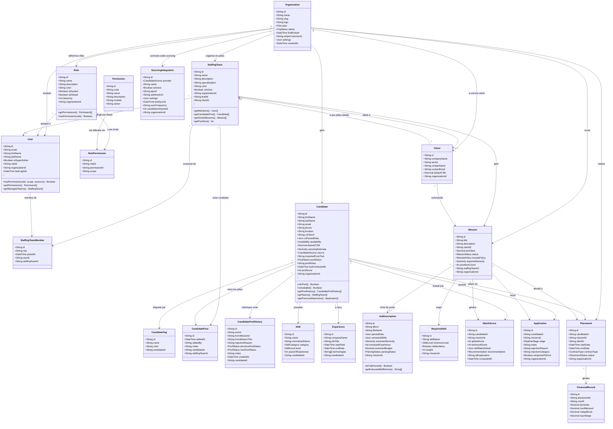

# Class Diagram

```mermaid
classDiagram
    class Organization {
        +String id
        +String name
        +String slug
        +String logo
        +Plan plan
        +OrgStatus status
        +DateTime trialEndsAt
        +String stripeCustomerId
        +Json settings
        +DateTime createdAt
    }

    class User {
        +String id
        +String email
        +String firstName
        +String lastName
        +Boolean isSuperAdmin
        +String roleId
        +String organizationId
        +DateTime lastLoginAt
        --
        +hasPermission(code, scope, resource) Boolean
        +getPermissions() Permission[]
        +getManagedTeams() StaffingTeam[]
    }

    class Permission {
        +String id
        +String code
        +String name
        +String description
        +String module
        +String action
    }

    class Role {
        +String id
        +String name
        +String description
        +String color
        +Boolean isSystem
        +Boolean isDefault
        +Int hierarchy
        +String organizationId
        --
        +getPermissions() Permission[]
        +hasPermission(code) Boolean
    }

    class RolePermission {
        +String id
        +String roleId
        +String permissionId
        +String scope
    }

    class StaffingTeam {
        +String id
        +String name
        +String description
        +String specialization
        +String color
        +Boolean isActive
        +String organizationId
        +String leadId
        +String clientId
        --
        +getMembers() User[]
        +getCandidatePool() Candidate[]
        +getActiveMissions() Mission[]
        +getPoolSize() Int
    }

    class StaffingTeamMember {
        +String id
        +String role
        +DateTime joinedAt
        +String userId
        +String staffingTeamId
    }

    class Candidate {
        +String id
        +String firstName
        +String lastName
        +String email
        +String phone
        +String location
        +String cvFileUrl
        +Json cvParsedData
        +Availability availability
        +Decimal desiredTJM
        +Seniority seniorityEstimate
        +CandidateSource source
        +String importedFromTool
        +PoolStatus poolStatus
        +String poolNotes
        +DateTime lastContactedAt
        +Int poolScore
        +String organizationId
        --
        +isInPool() Boolean
        +isAvailable() Boolean
        +getPoolHistory() CandidatePoolHistory[]
        +getTeams() StaffingTeam[]
        +getPreviousRejections() Application[]
    }

    class CandidateTag {
        +String id
        +String name
        +String color
        +String candidateId
    }

    class CandidatePool {
        +String id
        +DateTime addedAt
        +String addedBy
        +String notes
        +String candidateId
        +String staffingTeamId
    }

    class CandidatePoolHistory {
        +String id
        +String action
        +String fromMissionId
        +String fromMissionTitle
        +String rejectionReason
        +PoolStatus previousPoolStatus
        +PoolStatus newPoolStatus
        +String notes
        +DateTime createdAt
        +String candidateId
    }

    class Skill {
        +String id
        +String name
        +String normalizedName
        +SkillCategory category
        +SkillLevel level
        +Int yearsOfExperience
        +String candidateId
    }

    class Experience {
        +String id
        +String companyName
        +String jobTitle
        +DateTime startDate
        +DateTime endDate
        +String[] technologies
        +String candidateId
    }

    class SourcingIntegration {
        +String id
        +CandidateSource provider
        +String name
        +Boolean isActive
        +String apiUrl
        +String webhookUrl
        +Json settings
        +DateTime lastSyncAt
        +String syncFrequency
        +Int candidatesImported
        +String organizationId
    }

    class Client {
        +String id
        +String companyName
        +String sector
        +String contactName
        +String contactEmail
        +Decimal defaultTJM
        +String organizationId
    }

    class Mission {
        +String id
        +String title
        +String description
        +String clientId
        +Decimal tjmClient
        +MissionStatus status
        +RemotePolicy remotePolicy
        +Seniority requiredSeniority
        +Int positionsCount
        +String staffingTeamId
        +String organizationId
    }

    class JobDescription {
        +String id
        +String fileUrl
        +String fileName
        +Json parsedData
        +Json extractedSkills
        +Seniority extractedSeniority
        +Int extractedExperience
        +Decimal extractedBudget
        +ParsingStatus parsingStatus
        +String missionId
        --
        +isFullyParsed() Boolean
        +getExtractedSkillNames() String[]
    }

    class RequiredSkill {
        +String id
        +String skillName
        +SkillLevel minimumLevel
        +Boolean isMandatory
        +Int weight
        +String missionId
    }

    class MatchScore {
        +String id
        +String candidateId
        +String missionId
        +Int globalScore
        +Int technicalScore
        +Json skillMatchDetail
        +Recommendation recommendation
        +String aiExplanation
        +DateTime computedAt
    }

    class Application {
        +String id
        +String candidateId
        +String missionId
        +PipelineStage stage
        +String notes
        +String rejectionReason
        +String rejectionCategory
        +Boolean reinjectedToPool
        +String organizationId
    }

    class Placement {
        +String id
        +String candidateId
        +String missionId
        +String clientId
        +DateTime startDate
        +DateTime endDate
        +ContractType contractType
        +PlacementStatus status
        +String organizationId
    }

    class FinancialRecord {
        +String id
        +String placementId
        +String month
        +Decimal tjmVente
        +Decimal coutMensuel
        +Decimal margeBrute
        +Decimal tauxMarge
    }

    Organization "1" --> "*" Role : définit les rôles
    Organization "1" --> "*" User : emploie
    
    Role "1" --> "*" User : assigné à
    Role "1" --> "*" RolePermission : a les droits
    Permission "1" --> "*" RolePermission : est affectée via
    Organization "1" --> "*" StaffingTeam : organise en pôles
    Organization "1" --> "*" Candidate : gère
    Organization "1" --> "*" Client : a comme client
    Organization "1" --> "*" Mission : ouvre
    Organization "1" --> "*" Placement : réalise
    Organization "1" --> "*" SourcingIntegration : connecte outils sourcing

    StaffingTeam "1" --> "0..1" User : dirigé par (lead)
    StaffingTeam "1" --> "*" StaffingTeamMember : composé de
    StaffingTeam "1" --> "*" CandidatePool : vivier candidats
    StaffingTeam "0..1" --> "*" Mission : gère
    StaffingTeam "0..1" --> "0..1" Client : dédié à

    User "1" --> "*" StaffingTeamMember : membre de

    Client "1" --> "*" Mission : commande
    Client "1" --> "*" StaffingTeam : a des pôles dédiés

    Candidate "1" --> "*" Skill : possède
    Candidate "1" --> "*" Experience : a vécu
    Candidate "1" --> "*" CandidateTag : étiqueté par
    Candidate "1" --> "*" CandidatePool : dans les pôles
    Candidate "1" --> "*" CandidatePoolHistory : historique vivier
    Candidate "1" --> "*" Application : postule
    Candidate "1" --> "*" MatchScore : évalué par
    Candidate "1" --> "*" Placement : placé via

    Mission "1" --> "0..1" JobDescription : fiche de poste
    Mission "1" --> "*" RequiredSkill : exige
    Mission "1" --> "*" MatchScore : génère
    Mission "1" --> "*" Application : reçoit
    Mission "1" --> "*" Placement : aboutit à

    Placement "1" --> "*" FinancialRecord : génère
```
