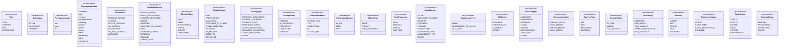

# Enums

```mermaid
classDiagram
    class Plan {
        <<enumeration>>
        TRIAL
        STARTER
        PRO
        ENTERPRISE
    }

    class OrgStatus {
        <<enumeration>>
        ACTIVE
        SUSPENDED
        CHURNED
    }

    class PermissionScope {
        <<enumeration>>
        own
        team
        all
    }

    class PermissionModule {
        <<enumeration>>
        candidates
        pool
        missions
        job_descriptions
        matching
        pipeline
        clients
        finance
        teams
        placements
        admin
        integrations
    }

    class PoolStatus {
        <<enumeration>>
        PENDING_REVIEW
        IN_POOL
        ACTIVE_PROCESS
        ON_MISSION
        BLACKLISTED
        DO_NOT_CONTACT
        ARCHIVED
    }

    class CandidateSource {
        <<enumeration>>
        MANUAL_IMPORT
        SMART_RECRUITERS
        LINKEDIN_RECRUITER
        INDEED
        MONSTER
        WELCOME_TO_JUNGLE
        APEC
        JOBBOARD_OTHER
        REFERRAL
        INBOUND
        CAREER_SITE
    }

    class MissionStatus {
        <<enumeration>>
        DRAFT
        OPEN
        IN_PROGRESS
        FILLED
        CLOSED
        CANCELLED
    }

    class PipelineStage {
        <<enumeration>>
        NEW
        PRESELECTED
        QUALIFYING
        PROPOSED_TO_CLIENT
        CLIENT_INTERVIEW
        VALIDATED
        ON_MISSION
        REJECTED
        CANCELLED
    }

    class ActivityType {
        <<enumeration>>
        TECHNICAL_EVALUATION
        INTERNAL_INTERVIEW
        TECHNICAL_TEST
        REFERENCE_CHECK
        SALARY_NEGOTIATION
        DOCUMENT_COLLECTION
        CLIENT_PRESCREEN
        OTHER
    }

    class ActivityStatus {
        <<enumeration>>
        PENDING
        IN_PROGRESS
        COMPLETED
        CANCELLED
        OVERDUE
    }

    class EvaluationVerdict {
        <<enumeration>>
        STRONG_YES
        YES
        CONDITIONAL
        NO
        STRONG_NO
    }

    class NotificationChannel {
        <<enumeration>>
        IN_APP
        EMAIL
        BOTH
    }

    class BillingType {
        <<enumeration>>
        REGIE
        FORFAIT
        SOUS_TRAITANCE
    }

    class CostFrequency {
        <<enumeration>>
        DAILY
        MONTHLY
        ANNUAL
        ONE_TIME
    }

    class CostCategory {
        <<enumeration>>
        SALARY
        EMPLOYER_CHARGES
        BENEFITS
        EQUIPMENT
        TRAINING
        RECRUITMENT
        SUBCONTRACTING
        MANAGEMENT_FEE
        OTHER
    }

    class CostAmountType {
        <<enumeration>>
        FIXED
        PERCENTAGE_OF_SALARY
        ASK_USER
    }

    class SkillLevel {
        <<enumeration>>
        BEGINNER
        INTERMEDIATE
        ADVANCED
        EXPERT
    }

    class SkillCategory {
        <<enumeration>>
        LANGUAGE
        FRAMEWORK
        DATABASE
        CLOUD
        DEVOPS
        METHODOLOGY
        SOFT_SKILL
        OTHER
    }

    class Recommendation {
        <<enumeration>>
        STRONG_MATCH
        GOOD_MATCH
        PARTIAL_MATCH
        WEAK_MATCH
    }

    class ContractType {
        <<enumeration>>
        CDI
        CDD
        FREELANCE
        PORTAGE
    }

    class RemotePolicy {
        <<enumeration>>
        ON_SITE
        HYBRID
        FULL_REMOTE
    }

    class Availability {
        <<enumeration>>
        IMMEDIATE
        ONE_MONTH
        TWO_MONTHS
        THREE_MONTHS_PLUS
        NOT_AVAILABLE
    }

    class Seniority {
        <<enumeration>>
        JUNIOR
        MID
        SENIOR
        LEAD
        ARCHITECT
    }

    class PlacementStatus {
        <<enumeration>>
        ACTIVE
        COMPLETED
        EARLY_TERMINATION
        RENEWED
    }

    class AuditAction {
        <<enumeration>>
        CREATE
        UPDATE
        DELETE
        LOGIN
        EXPORT
        IMPERSONATE
    }

    class ParsingStatus {
        <<enumeration>>
        PENDING
        PROCESSING
        COMPLETED
        FAILED
    }
```
