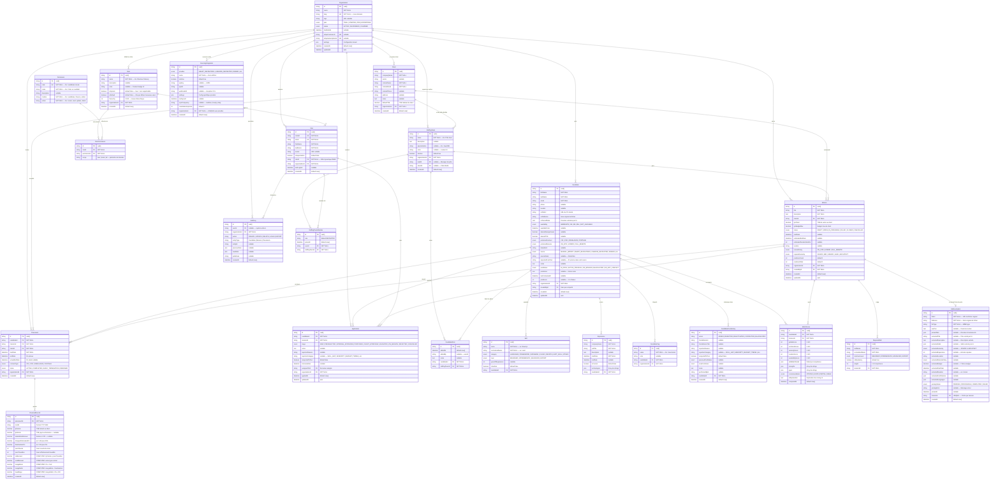

# Erd

```mermaid
erDiagram
    Organization ||--o{ Role : "définit les rôles"
    Organization ||--o{ User : "emploie"
    Organization ||--o{ StaffingTeam : "organise en pôles"

    Role ||--o{ User : "assigné à"
    Role ||--o{ RolePermission : "a les droits"
    Permission ||--o{ RolePermission : "affectée via"
    Organization ||--o{ Candidate : "gère"
    Organization ||--o{ Client : "a comme client"
    Organization ||--o{ Mission : "ouvre"
    Organization ||--o{ Placement : "réalise"
    Organization ||--o{ Application : "contient"
    Organization ||--o{ SourcingIntegration : "connecte outils"
    Organization ||--o{ AuditLog : "journalise"

    Client ||--o{ Mission : "commande"
    Client ||--o{ StaffingTeam : "a des pôles dédiés"
    
    StaffingTeam ||--o{ StaffingTeamMember : "composé de"
    StaffingTeam ||--o{ CandidatePool : "vivier"
    StaffingTeam ||--o{ Mission : "gère"

    User ||--o{ StaffingTeamMember : "membre de"
    Client ||--o{ Placement : "accueille"
    
    Candidate ||--o{ Skill : "possède"
    Candidate ||--o{ Experience : "a vécu"
    Candidate ||--o{ CandidateTag : "étiqueté"
    Candidate ||--o{ CandidatePool : "dans les pôles"
    Candidate ||--o{ CandidatePoolHistory : "historique vivier"
    Candidate ||--o{ Application : "postule"
    Candidate ||--o{ MatchScore : "est évalué"
    Candidate ||--o{ Placement : "est placé"
    
    Mission ||--o{ RequiredSkill : "exige"
    Mission ||--o| JobDescription : "a comme fiche de poste"
    Mission ||--o{ MatchScore : "reçoit"
    Mission ||--o{ Application : "reçoit"
    Mission ||--o{ Placement : "aboutit"
    
    Placement ||--o{ FinancialRecord : "génère"

    User ||--o{ Application : "gère"
    User ||--o{ AuditLog : "déclenche"

    Permission {
        string id PK "cuid()"
        string code UK "NOT NULL — Ex: candidates:create"
        string name "NOT NULL — Ex: Créer un candidat"
        string description "nullable"
        string module "NOT NULL — Ex: candidates, finance, admin"
        string action "NOT NULL — Ex: create, read, update, delete"
    }

    Role {
        string id PK "cuid()"
        string name "NOT NULL — Ex: Directeur Delivery"
        string description "nullable"
        string color "nullable — Couleur badge UI"
        boolean isSystem "default false — true = non supprimable"
        boolean isDefault "default false — rôle par défaut nouveaux users"
        int hierarchy "0-100 — niveau hiérarchique"
        string organizationId FK "NOT NULL"
        datetime createdAt "default now()"
    }

    RolePermission {
        string id PK "cuid()"
        string roleId FK "NOT NULL"
        string permissionId FK "NOT NULL"
        string scope "own | team | all — périmètre de données"
    }

    Organization {
        string id PK "cuid()"
        string name "NOT NULL"
        string slug UK "NOT NULL — sous-domaine"
        string logo "URL nullable"
        enum plan "TRIAL | STARTER | PRO | ENTERPRISE"
        enum status "ACTIVE | SUSPENDED | CHURNED"
        datetime trialEndsAt "nullable"
        string stripeCustomerId UK "nullable"
        string stripeSubscriptionId UK "nullable"
        json settings "Configuration tenant"
        datetime createdAt "default now()"
        datetime updatedAt "auto"
    }

    User {
        string id PK "cuid()"
        string clerkId UK "NOT NULL"
        string email UK "NOT NULL"
        string firstName "NOT NULL"
        string lastName "NOT NULL"
        string avatar "URL nullable"
        boolean isSuperAdmin "default false"
        string roleId FK "NOT NULL — Rôle dynamique RBAC"
        string organizationId FK "NOT NULL"
        datetime lastLoginAt "nullable"
        datetime createdAt "default now()"
    }

    Candidate {
        string id PK "cuid()"
        string firstName "NOT NULL"
        string lastName "NOT NULL"
        string email "NOT NULL"
        string phone "nullable"
        string location "nullable"
        string cvFileUrl "URL du CV stocké"
        string cvFileName "Nom original du fichier"
        json cvParsedData "Données extraites par IA"
        enum availability "IMMEDIATE | 1M | 2M | 3M+ | NOT_AVAILABLE"
        datetime availableFrom "nullable"
        decimal desiredSalaryAnnual "nullable"
        decimal desiredTJM "nullable"
        enum preferredContract "CDI | CDD | FREELANCE | PORTAGE"
        enum preferredRemote "ON_SITE | HYBRID | FULL_REMOTE"
        string linkedinUrl "nullable"
        enum source "MANUAL_IMPORT | SMART_RECRUITERS | LINKEDIN_RECRUITER | INDEED | etc."
        string sourceDetail "nullable — Détail libre"
        string importedFromTool "nullable — ID externe dans outil source"
        text notes "nullable"
        enum poolStatus "IN_POOL | ACTIVE_PROCESS | ON_MISSION | BLACKLISTED | DO_NOT_CONTACT"
        text poolNotes "nullable — Notes vivier"
        datetime lastContactedAt "nullable"
        int poolScore "nullable — 1-5 chaleur"
        string organizationId FK "NOT NULL"
        string createdById FK "User qui a importé"
        datetime createdAt "default now()"
        datetime updatedAt "auto"
    }

    Skill {
        string id PK "cuid()"
        string name "NOT NULL — ex: React.js"
        string normalizedName "NOT NULL — ex: react"
        enum category "LANGUAGE | FRAMEWORK | DATABASE | CLOUD | DEVOPS | SOFT_SKILL | OTHER"
        enum level "BEGINNER | INTERMEDIATE | ADVANCED | EXPERT"
        int yearsOfExperience "nullable"
        boolean isVerified "default false"
        string candidateId FK "NOT NULL"
    }

    Experience {
        string id PK "cuid()"
        string companyName "NOT NULL"
        string jobTitle "NOT NULL"
        text description "nullable"
        datetime startDate "NOT NULL"
        datetime endDate "nullable"
        boolean isCurrent "default false"
        json technologies "Array de strings"
        string candidateId FK "NOT NULL"
    }

    Client {
        string id PK "cuid()"
        string companyName "NOT NULL"
        string sector "nullable"
        string contactName "NOT NULL"
        string contactEmail "NOT NULL"
        string contactPhone "nullable"
        string address "nullable"
        text notes "nullable"
        decimal defaultTJM "TJM habituel du client"
        string organizationId FK "NOT NULL"
        datetime createdAt "default now()"
    }

    Mission {
        string id PK "cuid()"
        string title "NOT NULL"
        text description "NOT NULL"
        string clientId FK "NOT NULL"
        decimal tjmClient "TJM de vente au client"
        decimal tjmBudgetMax "Budget max du client"
        enum status "DRAFT | OPEN | IN_PROGRESS | FILLED | CLOSED | CANCELLED"
        datetime startDate "nullable"
        datetime estimatedEndDate "nullable"
        int estimatedDurationMonths "nullable"
        string location "nullable"
        enum remotePolicy "ON_SITE | HYBRID | FULL_REMOTE"
        enum requiredSeniority "JUNIOR | MID | SENIOR | LEAD | ARCHITECT"
        int positionsCount "default 1"
        int positionsFilled "default 0"
        string organizationId FK "NOT NULL"
        string createdById FK "NOT NULL"
        datetime createdAt "default now()"
        datetime updatedAt "auto"
    }

    RequiredSkill {
        string id PK "cuid()"
        string skillName "NOT NULL"
        string normalizedName "NOT NULL"
        enum minimumLevel "BEGINNER | INTERMEDIATE | ADVANCED | EXPERT"
        boolean isMandatory "default true"
        int weight "1-10 importance"
        string missionId FK "NOT NULL"
    }

    JobDescription {
        string id PK "cuid()"
        string fileUrl "NOT NULL — URL du fichier original"
        string fileName "NOT NULL — Nom original du fichier"
        string fileType "NOT NULL — MIME type"
        text rawText "nullable — Texte brut extrait"
        json parsedData "nullable — Données structurées IA"
        string extractedTitle "nullable — Titre extrait par IA"
        text extractedDescription "nullable — Description extraite"
        json extractedSkills "nullable — Skills extraits par IA"
        enum extractedSeniority "nullable — JUNIOR to ARCHITECT"
        int extractedExperience "nullable — Années requises"
        string extractedLocation "nullable"
        enum extractedRemotePolicy "nullable"
        decimal extractedBudget "nullable — TJM ou budget"
        datetime extractedStartDate "nullable"
        string extractedDuration "nullable — ex: 6 mois"
        json extractedCertifications "nullable"
        json extractedLanguages "nullable"
        enum parsingStatus "PENDING | PROCESSING | COMPLETED | FAILED"
        string parsingError "nullable — Message erreur"
        datetime parsedAt "nullable"
        string missionId FK "UNIQUE — 1 fiche par mission"
        datetime createdAt "default now()"
    }

    MatchScore {
        string id PK "cuid()"
        string candidateId FK "NOT NULL"
        string missionId FK "NOT NULL"
        int globalScore "0-100"
        int technicalScore "0-100"
        int seniorityScore "0-100"
        int locationScore "0-100"
        int availabilityScore "0-100"
        json skillMatchDetail "Détail par compétence"
        json strengths "Array de strings"
        json gaps "Array de strings"
        enum recommendation "STRONG | GOOD | PARTIAL | WEAK"
        text aiExplanation "Explication du scoring IA"
        datetime computedAt "default now()"
    }

    Application {
        string id PK "cuid()"
        string candidateId FK "NOT NULL"
        string missionId FK "NOT NULL"
        enum stage "NEW | PRESELECTED | INTERNAL_INTERVIEW | PROPOSED | CLIENT_INTERVIEW | VALIDATED | ON_MISSION | REJECTED | CANCELLED"
        text notes "nullable"
        string rejectionReason "nullable"
        string rejectionCategory "nullable — SKILL_GAP | SENIORITY | BUDGET | TIMING | etc."
        boolean reinjectedToPool "default false"
        datetime interviewDate "nullable"
        string assignedToId FK "Recruteur assigné"
        string organizationId FK "NOT NULL"
        datetime appliedAt "default now()"
        datetime updatedAt "auto"
    }

    Placement {
        string id PK "cuid()"
        string candidateId FK "NOT NULL"
        string missionId FK "NOT NULL"
        string clientId FK "NOT NULL"
        datetime startDate "NOT NULL"
        datetime endDate "Fin prévue"
        datetime actualEndDate "Fin réelle nullable"
        enum contractType "CDI | CDD | FREELANCE | PORTAGE"
        enum status "ACTIVE | COMPLETED | EARLY_TERMINATION | RENEWED"
        string organizationId FK "NOT NULL"
        datetime createdAt "default now()"
    }

    FinancialRecord {
        string id PK "cuid()"
        string placementId FK "NOT NULL"
        string month "Format YYYY-MM"
        decimal tjmVente "TJM facturé au client"
        decimal tjmAchat "TJM payé au freelance — nullable"
        decimal salaireBrutMensuel "Salaire si CDI — nullable"
        decimal chargesPatronalesPct "ex: 0.45 pour 45%"
        decimal fraisGestionPct "ex: 0.05 pour 5%"
        int joursOuvres "Jours ouvrés du mois"
        int joursTravailles "Jours effectivement travaillés"
        decimal caMensuel "COMPUTED: tjmVente x joursTravailles"
        decimal coutMensuel "COMPUTED: selon type contrat"
        decimal margeBrute "COMPUTED: CA - Coût"
        decimal margeNette "COMPUTED: margeBrute - fraisGestion"
        decimal tauxMarge "COMPUTED: margeNette / CA x 100"
        datetime createdAt "default now()"
    }

    StaffingTeam {
        string id PK "cuid()"
        string name "NOT NULL — Ex: Pôle Java"
        text description "nullable"
        string specialization "nullable — Ex: Java/JEE"
        string color "nullable — couleur UI"
        boolean isActive "default true"
        string organizationId FK "NOT NULL"
        string leadId FK "nullable — Manager du pôle"
        string clientId FK "nullable — Client dédié"
        datetime createdAt "default now()"
    }

    StaffingTeamMember {
        string id PK "cuid()"
        string role "default RECRUITER"
        datetime joinedAt "default now()"
        string userId FK "NOT NULL"
        string staffingTeamId FK "NOT NULL"
    }

    CandidateTag {
        string id PK "cuid()"
        string name "NOT NULL — Ex: Java Senior"
        string color "nullable"
        string candidateId FK "NOT NULL"
        string organizationId FK "NOT NULL"
    }

    CandidatePool {
        string id PK "cuid()"
        datetime addedAt "default now()"
        string addedBy "nullable — userId"
        text notes "nullable"
        string candidateId FK "NOT NULL"
        string staffingTeamId FK "NOT NULL"
    }

    CandidatePoolHistory {
        string id PK "cuid()"
        string action "ADDED | REJECTED | REACTIVATED | CONTACTED | BLACKLISTED"
        string fromMissionId "nullable"
        string fromMissionTitle "nullable"
        string rejectionReason "nullable"
        string rejectionCategory "nullable — SKILL_GAP | SENIORITY | BUDGET | TIMING | etc."
        boolean reinjectedToPool "default false"
        enum previousPoolStatus "nullable"
        enum newPoolStatus "nullable"
        text notes "nullable"
        string performedById "nullable"
        string candidateId FK "NOT NULL"
        datetime createdAt "default now()"
    }

    SourcingIntegration {
        string id PK "cuid()"
        enum provider "SMART_RECRUITERS | LINKEDIN_RECRUITER | INDEED | etc."
        string name "NOT NULL — Nom affiché"
        boolean isActive "default true"
        string apiKey "nullable — chiffré"
        string apiUrl "nullable"
        string webhookUrl "nullable — réception CVs"
        json settings "Config spécifique provider"
        datetime lastSyncAt "nullable"
        string syncFrequency "nullable — realtime | hourly | daily"
        int candidatesImported "default 0"
        string organizationId FK "NOT NULL — UNIQUE avec provider"
        datetime createdAt "default now()"
    }

    AuditLog {
        string id PK "cuid()"
        string userId FK "nullable — system actions"
        string organizationId FK "NOT NULL"
        string action "CREATE | UPDATE | DELETE | LOGIN | EXPORT"
        string entityType "Candidate | Mission | Placement..."
        string entityId "nullable"
        json previousData "nullable"
        json newData "nullable"
        string ipAddress "nullable"
        datetime createdAt "default now()"
    }
```
