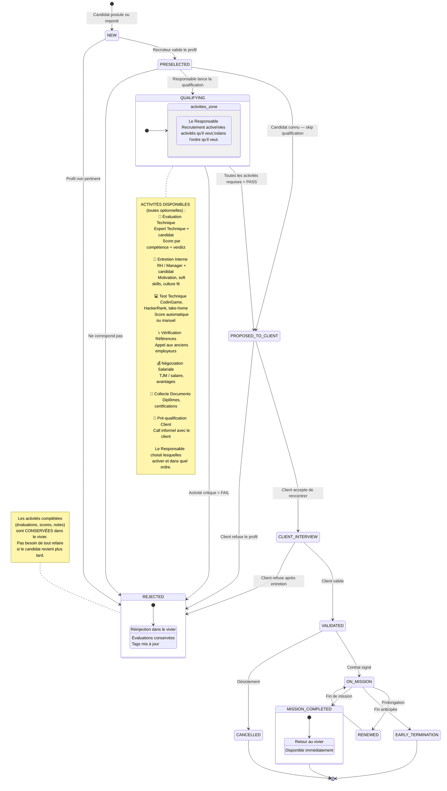

# Pipeline States



## Le pipeline flexible : comment ça marche

### Étapes fixes (obligatoires, dans l'ordre)

```
NEW → PRESELECTED → [QUALIFYING] → PROPOSED_TO_CLIENT → CLIENT_INTERVIEW → VALIDATED → ON_MISSION
```

### Étape QUALIFYING (flexible)

Quand un candidat passe en QUALIFYING, le Responsable Recrutement crée les **activités** qu'il juge nécessaires. Chaque activité est indépendante :

| Activité | Assignée à | Résultat |
|---|---|---|
| Évaluation Technique | Expert Technique | Verdict (STRONG_YES → STRONG_NO) + scores par compétence |
| Entretien Interne | Responsable ou Recruteur | PASS / FAIL + notes |
| Test Technique | Candidat (lien externe) | Score + PASS / FAIL |
| Vérification Références | Recruteur | OK / NOK + notes |
| Négociation Salariale | Responsable | Accord / Désaccord + TJM convenu |
| Collecte Documents | Recruteur | Complet / Incomplet |
| Pré-qualification Client | Delivery Manager | Intéressé / Pas intéressé |

### Règles de transition

- **QUALIFYING → PROPOSED_TO_CLIENT** : le Responsable décide manuellement quand le candidat est prêt. Pas de règle automatique — c'est son jugement.
- **QUALIFYING → REJECTED** : si une activité critique échoue (ex: évaluation technique = STRONG_NO), le Responsable peut rejeter.
- **PRESELECTED → PROPOSED_TO_CLIENT** : le Responsable peut skip la phase QUALIFYING s'il connaît déjà le candidat (ex: ancien consultant, déjà évalué dans le vivier).

### Exemples de scénarios

**Scénario A — Profil inconnu, mission exigeante :**
1. Évaluation Technique (Expert Java) → STRONG_YES
2. Entretien Interne (motivation, TJM) → PASS
3. → PROPOSED_TO_CLIENT

**Scénario B — Profil du vivier, déjà évalué :**
1. L'évaluation technique précédente est dans l'historique → pas besoin de refaire
2. Négociation TJM rapide → OK
3. → PROPOSED_TO_CLIENT

**Scénario C — Profil junior, le client veut vérifier :**
1. Test Technique (CodinGame) → 85/100
2. Entretien Interne → PASS
3. Pré-qualification Client (call informel) → Intéressé
4. → PROPOSED_TO_CLIENT

**Scénario D — Profil rare, urgence :**
1. → Skip QUALIFYING, directement PROPOSED_TO_CLIENT
