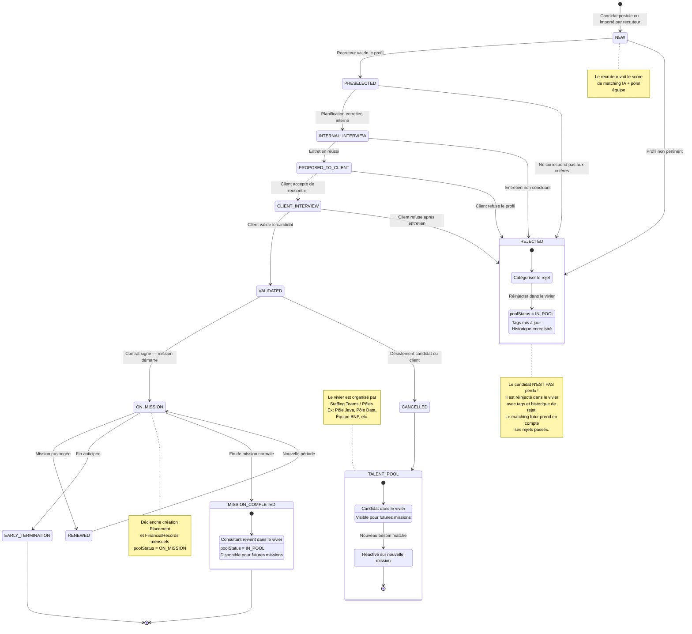

# Pipeline States

```mermaid
stateDiagram-v2
    [*] --> NEW: Candidat postule ou importé par recruteur

    NEW --> PRESELECTED: Recruteur valide le profil
    NEW --> REJECTED: Profil non pertinent
    
    PRESELECTED --> INTERNAL_INTERVIEW: Planification entretien interne
    PRESELECTED --> REJECTED: Ne correspond pas aux critères
    
    INTERNAL_INTERVIEW --> PROPOSED_TO_CLIENT: Entretien réussi
    INTERNAL_INTERVIEW --> REJECTED: Entretien non concluant
    
    PROPOSED_TO_CLIENT --> CLIENT_INTERVIEW: Client accepte de rencontrer
    PROPOSED_TO_CLIENT --> REJECTED: Client refuse le profil
    
    CLIENT_INTERVIEW --> VALIDATED: Client valide le candidat
    CLIENT_INTERVIEW --> REJECTED: Client refuse après entretien
    
    VALIDATED --> ON_MISSION: Contrat signé — mission démarre
    VALIDATED --> CANCELLED: Désistement candidat ou client
    
    ON_MISSION --> MISSION_COMPLETED: Fin de mission normale
    ON_MISSION --> RENEWED: Mission prolongée
    ON_MISSION --> EARLY_TERMINATION: Fin anticipée
    
    RENEWED --> ON_MISSION: Nouvelle période

    state REJECTED {
        [*] --> analyze_rejection
        analyze_rejection: Catégoriser le rejet
        analyze_rejection --> reinject_pool: Réinjecter dans le vivier
        reinject_pool: poolStatus = IN_POOL
        reinject_pool: Tags mis à jour
        reinject_pool: Historique enregistré
    }

    state MISSION_COMPLETED {
        [*] --> back_to_pool
        back_to_pool: Consultant revient dans le vivier
        back_to_pool: poolStatus = IN_POOL
        back_to_pool: Disponible pour futures missions
    }

    CANCELLED --> TALENT_POOL

    state TALENT_POOL {
        [*] --> in_pool
        in_pool: Candidat dans le vivier
        in_pool: Visible pour futures missions
        in_pool --> reactivated: Nouveau besoin matche
        reactivated: Réactivé sur nouvelle mission
        reactivated --> [*]
    }

    MISSION_COMPLETED --> [*]
    EARLY_TERMINATION --> [*]

    note right of NEW
        Le recruteur voit le score
        de matching IA + pôle/équipe
    end note

    note right of ON_MISSION
        Déclenche création Placement
        et FinancialRecords mensuels
        poolStatus = ON_MISSION
    end note

    note right of REJECTED
        Le candidat N'EST PAS perdu !
        Il est réinjecté dans le vivier
        avec tags et historique de rejet.
        Le matching futur prend en compte
        ses rejets passés.
    end note

    note left of TALENT_POOL
        Le vivier est organisé par
        Staffing Teams / Pôles.
        Ex: Pôle Java, Pôle Data,
        Équipe BNP, etc.
    end note
```
