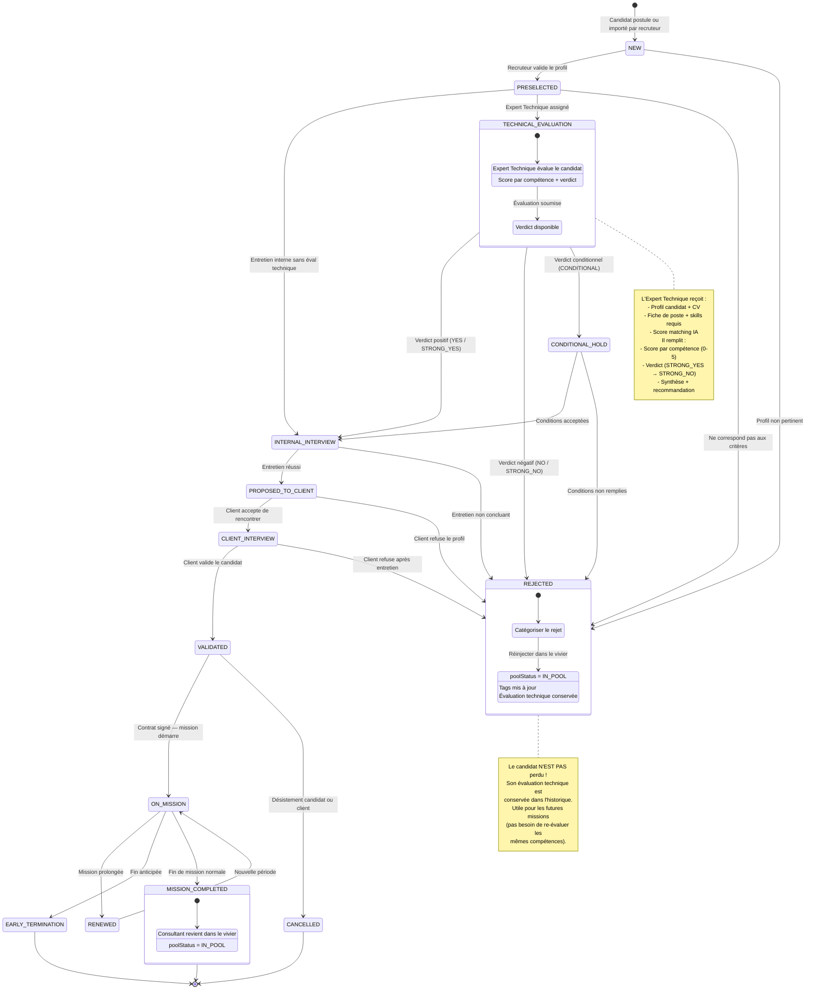

# Pipeline States

```mermaid
stateDiagram-v2
    [*] --> NEW: Candidat postule ou importé par recruteur

    NEW --> PRESELECTED: Recruteur valide le profil
    NEW --> REJECTED: Profil non pertinent
    
    PRESELECTED --> TECHNICAL_EVALUATION: Expert Technique assigné
    PRESELECTED --> INTERNAL_INTERVIEW: Entretien interne sans éval technique
    PRESELECTED --> REJECTED: Ne correspond pas aux critères

    state TECHNICAL_EVALUATION {
        [*] --> eval_pending
        eval_pending: Expert Technique évalue le candidat
        eval_pending: Score par compétence + verdict
        eval_pending --> eval_done: Évaluation soumise
        eval_done: Verdict disponible
    }

    TECHNICAL_EVALUATION --> INTERNAL_INTERVIEW: Verdict positif (YES / STRONG_YES)
    TECHNICAL_EVALUATION --> REJECTED: Verdict négatif (NO / STRONG_NO)
    TECHNICAL_EVALUATION --> CONDITIONAL_HOLD: Verdict conditionnel (CONDITIONAL)

    CONDITIONAL_HOLD --> INTERNAL_INTERVIEW: Conditions acceptées
    CONDITIONAL_HOLD --> REJECTED: Conditions non remplies

    INTERNAL_INTERVIEW --> PROPOSED_TO_CLIENT: Entretien réussi
    INTERNAL_INTERVIEW --> REJECTED: Entretien non concluant
    
    PROPOSED_TO_CLIENT --> CLIENT_INTERVIEW: Client accepte de rencontrer
    PROPOSED_TO_CLIENT --> REJECTED: Client refuse le profil
    
    CLIENT_INTERVIEW --> VALIDATED: Client valide le candidat
    CLIENT_INTERVIEW --> REJECTED: Client refuse après entretien
    
    VALIDATED --> ON_MISSION: Contrat signé — mission démarre
    VALIDATED --> CANCELLED: Désistement candidat ou client
    
    ON_MISSION --> MISSION_COMPLETED: Fin de mission normale
    ON_MISSION --> RENEWED: Mission prolongée
    ON_MISSION --> EARLY_TERMINATION: Fin anticipée
    
    RENEWED --> ON_MISSION: Nouvelle période

    state REJECTED {
        [*] --> analyze_rejection
        analyze_rejection: Catégoriser le rejet
        analyze_rejection --> reinject_pool: Réinjecter dans le vivier
        reinject_pool: poolStatus = IN_POOL
        reinject_pool: Tags mis à jour
        reinject_pool: Évaluation technique conservée
    }

    state MISSION_COMPLETED {
        [*] --> back_to_pool
        back_to_pool: Consultant revient dans le vivier
        back_to_pool: poolStatus = IN_POOL
    }

    CANCELLED --> [*]
    MISSION_COMPLETED --> [*]
    EARLY_TERMINATION --> [*]

    note right of TECHNICAL_EVALUATION
        L'Expert Technique reçoit :
        - Profil candidat + CV
        - Fiche de poste + skills requis
        - Score matching IA
        Il remplit :
        - Score par compétence (0-5)
        - Verdict (STRONG_YES → STRONG_NO)
        - Synthèse + recommandation
    end note

    note right of REJECTED
        Le candidat N'EST PAS perdu !
        Son évaluation technique est
        conservée dans l'historique.
        Utile pour les futures missions
        (pas besoin de re-évaluer les
        mêmes compétences).
    end note
```
