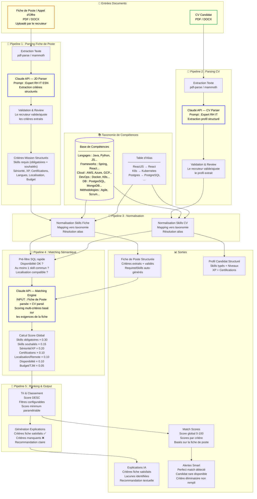

# AI Pipeline

```mermaid
graph TB
    subgraph "📄 Entrées Documents"
        CV["CV Candidat<br/>PDF / DOCX"]
        JD["Fiche de Poste / Appel d'Offre<br/>PDF / DOCX<br/>Uploadé par le recruteur"]
    end

    subgraph "🔄 Pipeline 1 : Parsing Fiche de Poste"
        JD_EXTRACT["Extraction Texte<br/>pdf-parse / mammoth"]
        JD_PARSE["Claude API — JD Parser<br/>Prompt : Expert RH IT ESN<br/>Extraction critères structurés"]
        JD_VALIDATE["Validation & Review<br/>Le recruteur valide/ajuste<br/>les critères extraits"]
        JD_OUTPUT["Critères Mission Structurés<br/>Skills requis (obligatoires + souhaités)<br/>Séniorité, XP, Certifications,<br/>Langues, Localisation, Budget"]
    end

    subgraph "🔄 Pipeline 2 : Parsing CV"
        CV_EXTRACT["Extraction Texte<br/>pdf-parse / mammoth"]
        CV_PARSE["Claude API — CV Parser<br/>Prompt : Expert RH IT<br/>Extraction profil structuré"]
        CV_VALIDATE["Validation & Review<br/>Le recruteur valide/ajuste<br/>le profil extrait"]
    end

    subgraph "📚 Taxonomie de Compétences"
        TAX_DB[("Base de Compétences<br/>────────────────<br/>Langages : Java, Python, JS...<br/>Frameworks : Spring, React...<br/>Cloud : AWS, Azure, GCP...<br/>DevOps : Docker, K8s...<br/>DB : PostgreSQL, MongoDB...<br/>Méthodologies : Agile, Scrum...")]
        ALIASES["Table d'Alias<br/>────────────────<br/>ReactJS → React<br/>K8s → Kubernetes<br/>Postgres → PostgreSQL<br/>..."]
    end

    subgraph "🔄 Pipeline 3 : Normalisation"
        NORM_JD["Normalisation Skills Fiche<br/>Mapping vers taxonomie<br/>Résolution alias"]
        NORM_CV["Normalisation Skills CV<br/>Mapping vers taxonomie<br/>Résolution alias"]
    end

    subgraph "🔄 Pipeline 4 : Matching Sémantique"
        PREFILTER["Pré-filtre SQL rapide<br/>Disponibilité OK ?<br/>Au moins 1 skill commun ?<br/>Localisation compatible ?"]
        MATCH["Claude API — Matching Engine<br/>INPUT : Fiche de Poste parsée + CV parsé<br/>Scoring multi-critères basé sur<br/>les exigences de la fiche"]
        SCORE["Calcul Score Global<br/>Skills obligatoires × 0.30<br/>Skills souhaités × 0.15<br/>Séniorité/XP × 0.20<br/>Certifications × 0.10<br/>Localisation/Remote × 0.10<br/>Disponibilité × 0.10<br/>Budget/TJM × 0.05"]
    end

    subgraph "🔄 Pipeline 5 : Ranking & Output"
        RANK["Tri & Classement<br/>Score DESC<br/>Filtres configurables<br/>Score minimum paramétrable"]
        EXPLAIN["Génération Explications<br/>Critères fiche satisfaits ✅<br/>Critères manquants ❌<br/>Recommandation claire"]
    end

    subgraph "📊 Sorties"
        JD_STRUCTURED["Fiche de Poste Structurée<br/>Critères extraits + validés<br/>RequiredSkills auto-générés"]
        CV_STRUCTURED["Profil Candidat Structuré<br/>Skills typés + Niveaux<br/>XP + Certifications"]
        SCORES["Match Scores<br/>Score global 0-100<br/>Scores par critère<br/>Basés sur la fiche de poste"]
        EXPLANATIONS["Explications IA<br/>Critères fiche satisfaits<br/>Lacunes identifiées<br/>Recommandation textuelle"]
        ALERTS["Alertes Smart<br/>Perfect match détecté<br/>Candidat rare disponible<br/>Critère éliminatoire non rempli"]
    end

    JD --> JD_EXTRACT
    JD_EXTRACT --> JD_PARSE
    JD_PARSE --> JD_VALIDATE
    JD_VALIDATE --> JD_OUTPUT

    JD_OUTPUT --> NORM_JD
    TAX_DB --> NORM_JD
    ALIASES --> NORM_JD
    NORM_JD --> JD_STRUCTURED
    NORM_JD --> PREFILTER

    CV --> CV_EXTRACT
    CV_EXTRACT --> CV_PARSE
    CV_PARSE --> CV_VALIDATE

    CV_VALIDATE --> NORM_CV
    TAX_DB --> NORM_CV
    ALIASES --> NORM_CV
    NORM_CV --> CV_STRUCTURED
    NORM_CV --> PREFILTER

    PREFILTER --> MATCH
    JD_STRUCTURED --> MATCH
    
    MATCH --> SCORE
    SCORE --> RANK
    RANK --> SCORES
    RANK --> EXPLAIN
    EXPLAIN --> EXPLANATIONS
    SCORES --> ALERTS

    style JD_PARSE fill:transparent,stroke:#6366f1,stroke-width:3px,color:#000
    style CV_PARSE fill:transparent,stroke:#6366f1,stroke-width:3px,color:#000
    style MATCH fill:transparent,stroke:#6366f1,stroke-width:3px,color:#000
    style JD fill:transparent,stroke:#d97706,stroke-width:2px,color:#000
    style CV fill:transparent,stroke:#16a34a,stroke-width:2px,color:#000
    style TAX_DB fill:transparent,stroke:#8b5cf6,stroke-width:2px,color:#000
```
