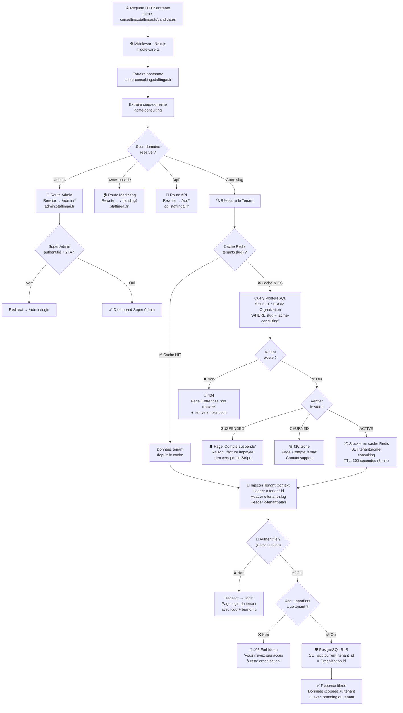

# Multi Tenant Resolution

```mermaid
graph TB
    REQ["🌐 Requête HTTP entrante<br/>acme-consulting.staffingai.fr/candidates"]

    REQ --> MW["⚙️ Middleware Next.js<br/>middleware.ts"]
    MW --> EXTRACT["Extraire hostname<br/>acme-consulting.staffingai.fr"]
    EXTRACT --> SPLIT["Extraire sous-domaine<br/>'acme-consulting'"]

    SPLIT --> CHECK{"Sous-domaine<br/>réservé ?"}

    CHECK -->|"'admin'"| ADMIN_ROUTE["🔐 Route Admin<br/>Rewrite → /admin/*<br/>admin.staffingai.fr"]
    CHECK -->|"'www' ou vide"| MARKETING["🏠 Route Marketing<br/>Rewrite → / (landing)<br/>staffingai.fr"]
    CHECK -->|"'api'"| API_ROUTE["🔌 Route API<br/>Rewrite → /api/*<br/>api.staffingai.fr"]
    CHECK -->|"Autre slug"| TENANT_RESOLVE["🔍 Résoudre le Tenant"]

    TENANT_RESOLVE --> CACHE{"Cache Redis<br/>tenant:{slug} ?"}
    
    CACHE -->|"✅ Cache HIT"| CACHE_DATA["Données tenant<br/>depuis le cache"]
    CACHE -->|"❌ Cache MISS"| DB_LOOKUP["Query PostgreSQL<br/>SELECT * FROM Organization<br/>WHERE slug = 'acme-consulting'"]

    DB_LOOKUP --> EXISTS{"Tenant<br/>existe ?"}
    EXISTS -->|"❌ Non"| NOT_FOUND["🚫 404<br/>Page 'Entreprise non trouvée'<br/>+ lien vers inscription"]
    EXISTS -->|"✅ Oui"| CHECK_STATUS{"Vérifier<br/>le statut"}

    CHECK_STATUS -->|"SUSPENDED"| SUSPENDED["⏸️ Page 'Compte suspendu'<br/>Raison : facture impayée<br/>Lien vers portail Stripe"]
    CHECK_STATUS -->|"CHURNED"| GONE["🗑️ 410 Gone<br/>Page 'Compte fermé'<br/>Contact support"]
    CHECK_STATUS -->|"ACTIVE"| CACHE_SET["📦 Stocker en cache Redis<br/>SET tenant:acme-consulting<br/>TTL: 300 secondes (5 min)"]

    CACHE_SET --> INJECT
    CACHE_DATA --> INJECT["💉 Injecter Tenant Context<br/>Header x-tenant-id<br/>Header x-tenant-slug<br/>Header x-tenant-plan"]

    INJECT --> AUTH{"🔑 Authentifié ?<br/>(Clerk session)"}

    AUTH -->|"❌ Non"| LOGIN["Redirect → /login<br/>Page login du tenant<br/>avec logo + branding"]
    AUTH -->|"✅ Oui"| VERIFY_MEMBERSHIP{"User appartient<br/>à ce tenant ?"}

    VERIFY_MEMBERSHIP -->|"❌ Non"| FORBIDDEN["🚫 403 Forbidden<br/>'Vous n'avez pas accès<br/>à cette organisation'"]
    VERIFY_MEMBERSHIP -->|"✅ Oui"| RLS["🛡️ PostgreSQL RLS<br/>SET app.current_tenant_id<br/>= Organization.id"]

    RLS --> RESPONSE["✅ Réponse filtrée<br/>Données scopées au tenant<br/>UI avec branding du tenant"]

    ADMIN_ROUTE --> ADMIN_AUTH{"Super Admin<br/>authentifié + 2FA ?"}
    ADMIN_AUTH -->|"Non"| ADMIN_LOGIN["Redirect → /admin/login"]
    ADMIN_AUTH -->|"Oui"| ADMIN_OK["✅ Dashboard Super Admin"]

```
