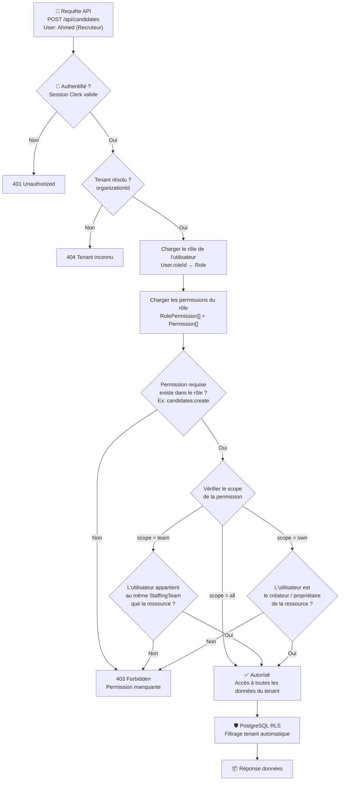

# RBAC — Vérification des Permissions



## Exemples concrets

### Exemple 1 : Recruteur crée un candidat dans son pôle
```
User: Ahmed (rôle "Recruteur", pôle Java)
Action: POST /api/candidates (dans le pôle Java)
Permission requise: candidates:create
Scope du rôle: team
Vérification: Ahmed est membre du pôle Java → ✅ Autorisé
```

### Exemple 2 : Recruteur tente de voir les finances globales
```
User: Ahmed (rôle "Recruteur")
Action: GET /api/finance/dashboard?view=global
Permission requise: finance:read_global
Vérification: Le rôle "Recruteur" n'a pas finance:read_global → ❌ 403 Forbidden
```

### Exemple 3 : Directeur Delivery voit les candidats de tous les pôles
```
User: Paul (rôle "Directeur Delivery")
Action: GET /api/candidates
Permission requise: candidates:read
Scope du rôle: all
Vérification: scope = all → ✅ Voit tous les candidats du tenant
```

### Exemple 4 : Admin personnalise un rôle
```
L'admin de l'ESN "TechStaff" décide que ses recruteurs
doivent aussi pouvoir voir les finances de leur pôle.

Action: Ajouter la permission finance:read avec scope "team"
au rôle "Recruteur" de son organisation.

→ Tous les recruteurs voient maintenant les finances de leur pôle.
→ Aucun changement de code nécessaire.
```
