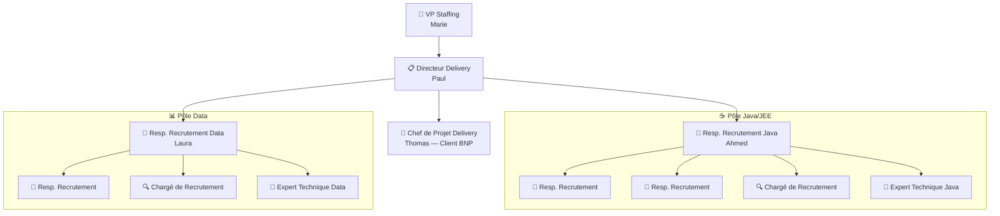
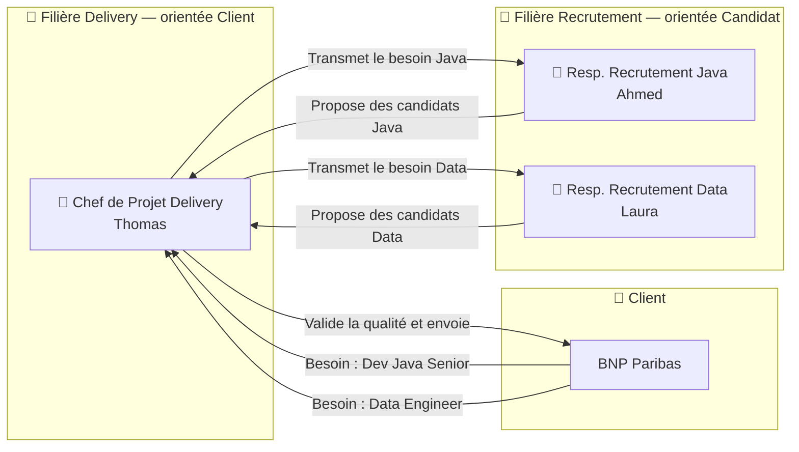
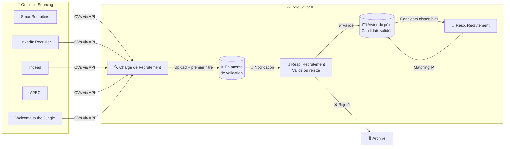
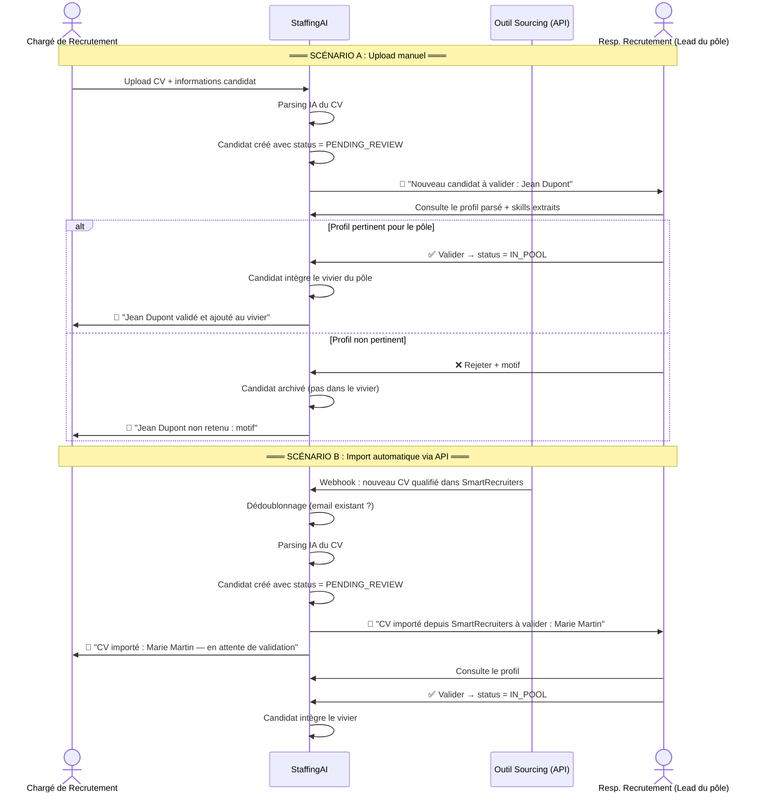

# Staffing Teams — Organisation & Rôles

## 1. Organigramme

## 2. Croisement des filières : Delivery × Recrutement

## 3. Circuit du sourcing — avec validation

## 4. Détail du circuit de validation des CVs

## Les rôles expliqués

### Filière Delivery (orientée client)

| Rôle | Ce qu'il fait | Dans le SaaS |
|------|-------------|-------------|
| **VP Staffing** | Stratégie globale, décide l'ouverture/fermeture de pôles | Dashboard financier consolidé, KPIs globaux |
| **Directeur Delivery** | Supervise plusieurs pôles, arbitre les priorités | Vue multi-pôles, rapports inter-équipes |
| **Chef de Projet Delivery** | Responsable d'un client : qualité, renouvellements, TJM. Même autorité qu'un Directeur mais scopée au client | Missions de son client, placements, finance par client |

### Filière Recrutement (orientée candidat)

| Rôle | Ce qu'il fait | Dans le SaaS |
|------|-------------|-------------|
| **Resp. Recrutement (Lead)** | Pilote un pôle, distribue les missions, **valide les candidats avant intégration au vivier**, valide avant proposition client | Dashboard pôle, vivier, pipeline, matching IA, validation CVs |
| **Resp. Recrutement** | Process complet : qualification → activités → proposition → suivi | Pipeline Kanban, matching IA, activités de qualification |
| **Chargé de Recrutement** | Source via outils externes, alimente le vivier **(soumis à validation du Lead)**, premier filtre | Upload CVs, intégrations sourcing, tags |
| **Expert Technique** | Évalue techniquement les candidats quand on lui assigne une activité | Activités assignées, formulaire d'évaluation |

### Pourquoi la validation est nécessaire

Sans validation, n'importe quel CV sourcé atterrit directement dans le vivier. Résultat : vivier pollué, matching IA dégradé (bruit dans les résultats), perte de confiance des recruteurs dans l'outil. Le Resp. Recrutement (Lead du pôle) est le **gardien de la qualité du vivier**. Il valide que le profil est pertinent pour son pôle avant de l'intégrer.
