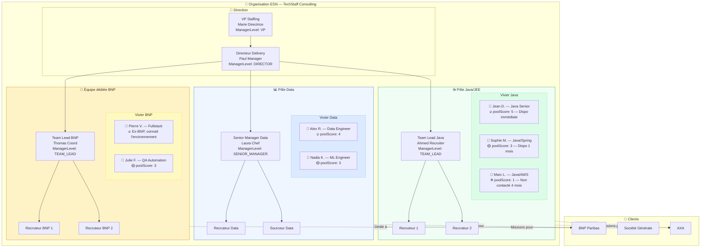

# Staffing Teams Organization

## Modes d'organisation

Un Staffing Team (Pôle) peut être organisé de deux façons :

### Par spécialisation technique
- **Pôle Java/JEE** : tous les recruteurs spécialisés Java, vivier de candidats Java
- **Pôle Data** : Data Engineers, Data Scientists, ML Engineers
- **Pôle DevOps/Cloud** : profils infra, CI/CD, cloud

### Par client dédié
- **Équipe BNP** : recruteurs dédiés à BNP, tous profils confondus
- **Équipe SocGen** : idem pour Société Générale

### Mode hybride
Les deux modes coexistent. Un candidat peut appartenir à plusieurs pôles (ex: un profil Java qui est aussi dans le vivier BNP).
