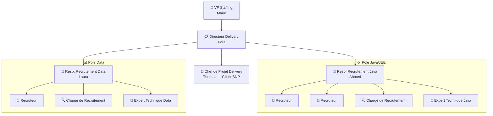
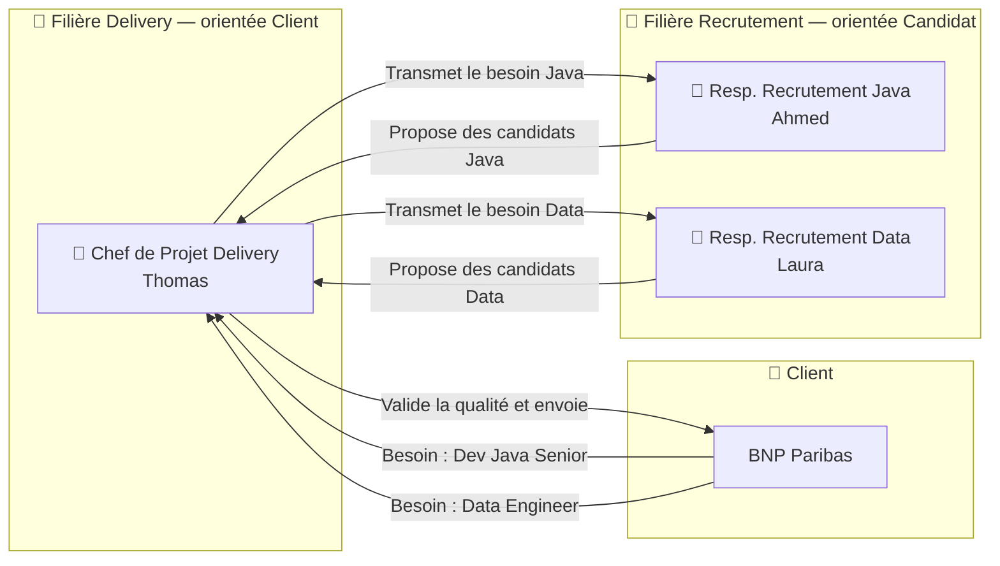
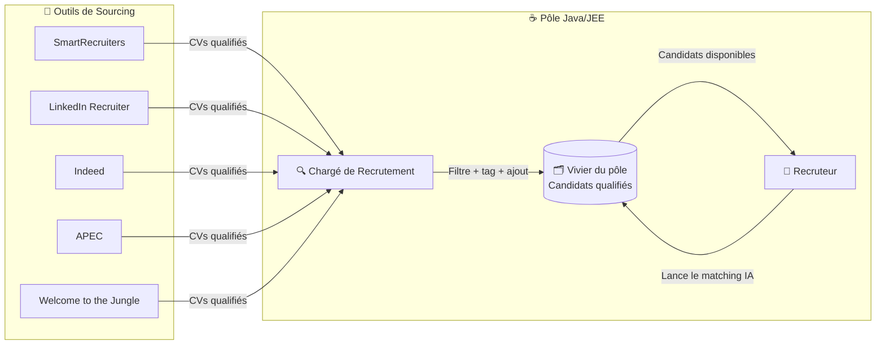

# Staffing Teams — Organisation & Rôles

## 1. Organigramme

## 2. Croisement des filières : Delivery × Recrutement

## 3. Circuit du sourcing

## Les rôles expliqués

### Filière Delivery (orientée client)

| Rôle | Ce qu'il fait | Dans le SaaS |
|------|-------------|-------------|
| **VP Staffing** | Stratégie globale, décide l'ouverture/fermeture de pôles | Dashboard financier consolidé, KPIs globaux |
| **Directeur Delivery** | Supervise plusieurs pôles, arbitre les priorités | Vue multi-pôles, rapports inter-équipes |
| **Chef de Projet Delivery** | Responsable d'un client : qualité, renouvellements, TJM. Même autorité qu'un Directeur mais scopée au client | Missions de son client, placements, finance par client |

### Filière Recrutement (orientée candidat)

| Rôle | Ce qu'il fait | Dans le SaaS |
|------|-------------|-------------|
| **Resp. Recrutement** | Pilote un pôle, distribue les missions, valide avant client | Dashboard pôle, vivier, pipeline, matching IA |
| **Recruteur** | Process complet : qualification → entretien → proposition → suivi | Pipeline Kanban, matching IA, activités de qualification |
| **Chargé de Recrutement** | Source via outils externes, alimente le vivier, premier filtre | Upload CVs, intégrations sourcing, tags, vivier |
| **Expert Technique** | Évalue techniquement les candidats quand on lui assigne une activité | Activités assignées, formulaire d'évaluation |

### Comment les deux filières se croisent

Le client BNP envoie un appel d'offre pour un "Dev Java Senior". Thomas (Chef de Projet Delivery BNP) reçoit le besoin et le transmet à Ahmed (Resp. Recrutement Java). Ahmed active son pôle : le Chargé de Recrutement source sur LinkedIn, le Recruteur lance le matching IA sur le vivier, l'Expert Technique évalue les candidats shortlistés. Ahmed propose les meilleurs profils à Thomas, qui valide la qualité et les envoie au client.

Quand BNP a besoin d'un Data Engineer, Thomas transmet à Laura (Resp. Recrutement Data) — même mécanique, autre pôle.
