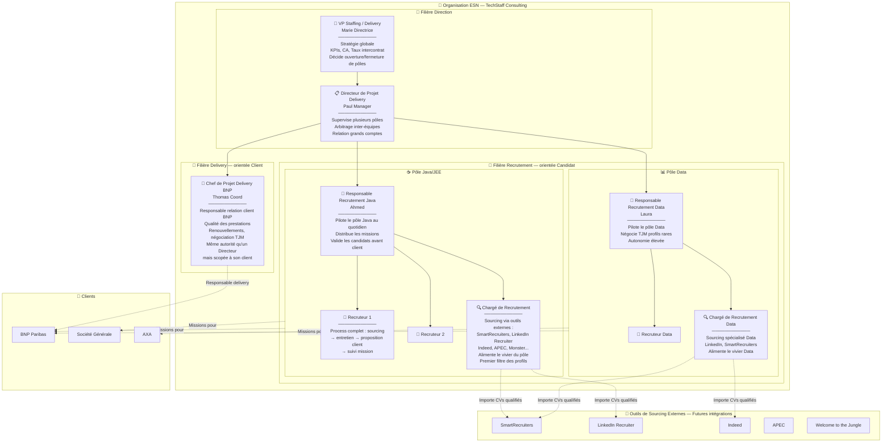

# Staffing Teams — Organisation & Rôles

## Les deux filières d'une ESN

### Filière Delivery (orientée client)

| Rôle | Responsabilité | Dans le SaaS |
|------|---------------|-------------|
| **VP Staffing** | Stratégie globale, KPIs, ouverture/fermeture de pôles | Dashboard financier consolidé, métriques globales |
| **Directeur Delivery** | Supervise plusieurs pôles, arbitrage, grands comptes | Vue multi-pôles, rapports inter-équipes |
| **Chef de Projet Delivery** | Responsable relation client, qualité des prestations, renouvellements. Même autorité qu'un Directeur mais scopée à son/ses client(s) | Vue missions de son client, suivi placements, financier par client |

### Filière Recrutement (orientée candidat)

| Rôle | Responsabilité | Dans le SaaS |
|------|---------------|-------------|
| **Responsable Recrutement** | Pilote un pôle, distribue les missions, valide les candidats avant proposition client | Dashboard du pôle, vivier, pipeline, matching IA |
| **Recruteur** | Process complet bout en bout : qualification, entretiens, proposition client, suivi | Pipeline Kanban, matching IA, suivi candidatures |
| **Chargé de Recrutement** | Sourcing candidats via outils externes, alimentation du vivier, premier filtre | Upload CVs en masse, connexion outils sourcing, tags, vivier |

### Croisement des filières

Le Chef de Projet Delivery BNP (Thomas) et le Responsable Recrutement Java (Ahmed) travaillent ensemble : Thomas définit les besoins clients BNP, Ahmed fournit les candidats Java depuis son pôle. Quand BNP a besoin d'un profil Data, Thomas travaille avec le Pôle Data de Laura.

## Futures intégrations sourcing

Les Chargés de Recrutement utilisent des outils externes pour sourcer. Le SaaS doit à terme s'intégrer avec ces plateformes pour :

- **Import automatique** des CVs qualifiés par les chargés de recrutement
- **Sync bidirectionnel** des statuts candidats
- **Dédoublonnage** automatique (un même candidat sur plusieurs plateformes)
- **Traçabilité** de la source de chaque candidat

Plateformes ciblées pour intégration : SmartRecruiters, LinkedIn Recruiter, Indeed, APEC, Monster, Welcome to the Jungle.
