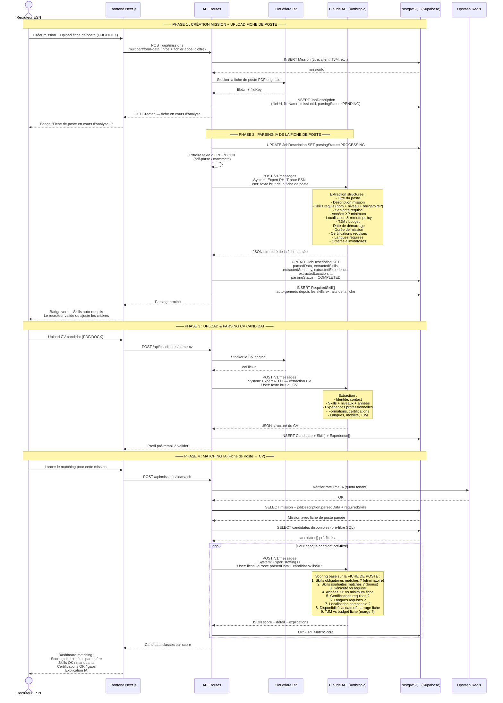

# CV Parsing & Matching IA (basé sur Fiche de Poste)

```mermaid
sequenceDiagram
    actor R as Recruteur ESN
    participant APP as Frontend Next.js
    participant API as API Routes
    participant S3 as Cloudflare R2
    participant AI as Claude API (Anthropic)
    participant DB as PostgreSQL (Supabase)
    participant REDIS as Upstash Redis

    Note over R,DB: ═══ PHASE 1 : CRÉATION MISSION + UPLOAD FICHE DE POSTE ═══

    R->>APP: Créer mission + Upload fiche de poste (PDF/DOCX)
    APP->>API: POST /api/missions<br/>multipart/form-data (infos + fichier appel d'offre)

    API->>DB: INSERT Mission (titre, client, TJM, etc.)
    DB-->>API: missionId

    API->>S3: Stocker la fiche de poste PDF originale
    S3-->>API: fileUrl + fileKey

    API->>DB: INSERT JobDescription<br/>(fileUrl, fileName, missionId, parsingStatus=PENDING)

    API-->>APP: 201 Created — fiche en cours d'analyse
    APP-->>R: Badge "Fiche de poste en cours d'analyse..."

    Note over API,AI: ═══ PHASE 2 : PARSING IA DE LA FICHE DE POSTE ═══

    API->>DB: UPDATE JobDescription SET parsingStatus=PROCESSING

    API->>API: Extraire texte du PDF/DOCX<br/>(pdf-parse / mammoth)

    API->>AI: POST /v1/messages<br/>System: Expert RH IT pour ESN<br/>User: texte brut de la fiche de poste

    Note over AI: Extraction structurée :<br/>- Titre du poste<br/>- Description mission<br/>- Skills requis (nom + niveau + obligatoire?)<br/>- Séniorité requise<br/>- Années XP minimum<br/>- Localisation & remote policy<br/>- TJM / budget<br/>- Date de démarrage<br/>- Durée de mission<br/>- Certifications requises<br/>- Langues requises<br/>- Critères éliminatoires

    AI-->>API: JSON structuré de la fiche parsée

    API->>DB: UPDATE JobDescription SET<br/>parsedData, extractedSkills,<br/>extractedSeniority, extractedExperience,<br/>extractedLocation, ...<br/>parsingStatus = COMPLETED

    API->>DB: INSERT RequiredSkill[]<br/>auto-générés depuis les skills extraits de la fiche

    API-->>APP: Parsing terminé
    APP-->>R: Badge vert — Skills auto-remplis<br/>Le recruteur valide ou ajuste les critères

    Note over R,DB: ═══ PHASE 3 : UPLOAD & PARSING CV CANDIDAT ═══

    R->>APP: Upload CV candidat (PDF/DOCX)
    APP->>API: POST /api/candidates/parse-cv

    API->>S3: Stocker le CV original
    S3-->>API: cvFileUrl

    API->>AI: POST /v1/messages<br/>System: Expert RH IT — extraction CV<br/>User: texte brut du CV

    Note over AI: Extraction :<br/>- Identité, contact<br/>- Skills + niveaux + années<br/>- Expériences professionnelles<br/>- Formations, certifications<br/>- Langues, mobilité, TJM

    AI-->>API: JSON structuré du CV

    API->>DB: INSERT Candidate + Skill[] + Experience[]
    API-->>APP: Profil pré-rempli à valider

    Note over R,DB: ═══ PHASE 4 : MATCHING IA (Fiche de Poste ↔ CV) ═══

    R->>APP: Lancer le matching pour cette mission
    APP->>API: POST /api/missions/:id/match

    API->>REDIS: Vérifier rate limit IA (quota tenant)
    REDIS-->>API: OK

    API->>DB: SELECT mission + jobDescription.parsedData + requiredSkills
    DB-->>API: Mission avec fiche de poste parsée

    API->>DB: SELECT candidates disponibles (pré-filtre SQL)
    DB-->>API: candidates[] pré-filtrés

    loop Pour chaque candidat pré-filtré
        API->>AI: POST /v1/messages<br/>System: Expert staffing IT<br/>User: ficheDePoste.parsedData + candidat.skills/XP

        Note over AI: Scoring basé sur la FICHE DE POSTE :<br/>1. Skills obligatoires matchés ? (éliminatoire)<br/>2. Skills souhaités matchés ? (bonus)<br/>3. Séniorité vs requise<br/>4. Années XP vs minimum fiche<br/>5. Certifications requises ?<br/>6. Langues requises ?<br/>7. Localisation compatible ?<br/>8. Disponibilité vs date démarrage fiche<br/>9. TJM vs budget fiche (marge ?)

        AI-->>API: JSON score + détail + explications

        API->>DB: UPSERT MatchScore
    end

    API-->>APP: Candidats classés par score
    APP-->>R: Dashboard matching :<br/>Score global + détail par critère<br/>Skills OK / manquants<br/>Certifications OK / gaps<br/>Explication IA
```
