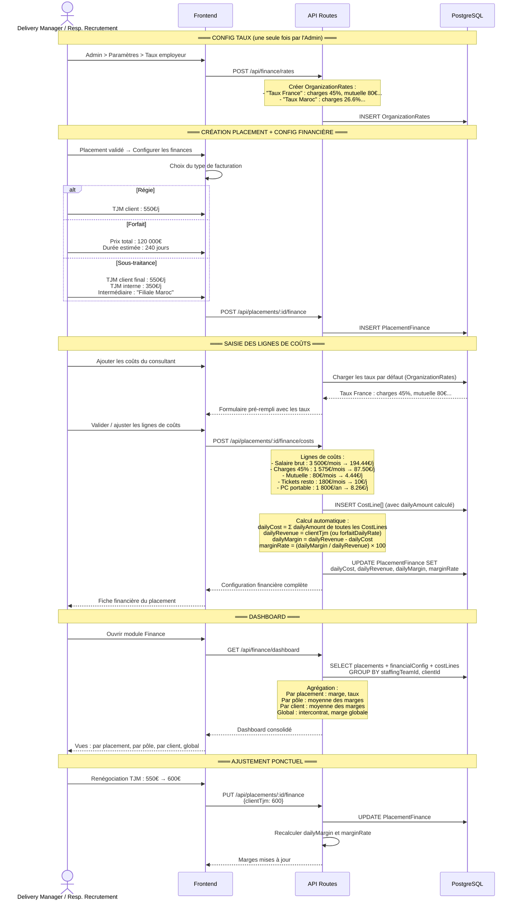

# Financial Calculation

```mermaid
sequenceDiagram
    actor DM as Delivery Manager / Resp. Recrutement
    participant APP as Frontend
    participant API as API Routes
    participant DB as PostgreSQL

    Note over DM,DB: ═══ CONFIG TAUX (une seule fois par l'Admin) ═══

    DM->>APP: Admin > Paramètres > Taux employeur
    APP->>API: POST /api/finance/rates
    Note over API: Créer OrganizationRates :<br/>- "Taux France" : charges 45%, mutuelle 80€...<br/>- "Taux Maroc" : charges 26.6%...
    API->>DB: INSERT OrganizationRates
    
    Note over DM,DB: ═══ CRÉATION PLACEMENT + CONFIG FINANCIÈRE ═══

    DM->>APP: Placement validé → Configurer les finances
    APP->>APP: Choix du type de facturation

    alt Régie
        DM->>APP: TJM client : 550€/j
    else Forfait
        DM->>APP: Prix total : 120 000€<br/>Durée estimée : 240 jours
    else Sous-traitance
        DM->>APP: TJM client final : 550€/j<br/>TJM interne : 350€/j<br/>Intermédiaire : "Filiale Maroc"
    end

    APP->>API: POST /api/placements/:id/finance
    API->>DB: INSERT PlacementFinance

    Note over DM,DB: ═══ SAISIE DES LIGNES DE COÛTS ═══

    DM->>APP: Ajouter les coûts du consultant

    API->>DB: Charger les taux par défaut (OrganizationRates)
    DB-->>API: Taux France : charges 45%, mutuelle 80€...
    API-->>APP: Formulaire pré-rempli avec les taux

    DM->>APP: Valider / ajuster les lignes de coûts
    APP->>API: POST /api/placements/:id/finance/costs

    Note over API: Lignes de coûts :<br/>- Salaire brut : 3 500€/mois → 194.44€/j<br/>- Charges 45% : 1 575€/mois → 87.50€/j<br/>- Mutuelle : 80€/mois → 4.44€/j<br/>- Tickets resto : 180€/mois → 10€/j<br/>- PC portable : 1 800€/an → 8.26€/j

    API->>DB: INSERT CostLine[] (avec dailyAmount calculé)

    Note over API: Calcul automatique :<br/>dailyCost = Σ dailyAmount de toutes les CostLines<br/>dailyRevenue = clientTjm (ou forfaitDailyRate)<br/>dailyMargin = dailyRevenue - dailyCost<br/>marginRate = (dailyMargin / dailyRevenue) × 100

    API->>DB: UPDATE PlacementFinance SET<br/>dailyCost, dailyRevenue, dailyMargin, marginRate

    API-->>APP: Configuration financière complète
    APP-->>DM: Fiche financière du placement

    Note over DM,DB: ═══ DASHBOARD ═══

    DM->>APP: Ouvrir module Finance
    APP->>API: GET /api/finance/dashboard

    API->>DB: SELECT placements + financialConfig + costLines<br/>GROUP BY staffingTeamId, clientId

    Note over API: Agrégation :<br/>Par placement : marge, taux<br/>Par pôle : moyenne des marges<br/>Par client : moyenne des marges<br/>Global : intercontrat, marge globale

    API-->>APP: Dashboard consolidé
    APP-->>DM: Vues : par placement, par pôle, par client, global

    Note over DM,DB: ═══ AJUSTEMENT PONCTUEL ═══

    DM->>APP: Renégociation TJM : 550€ → 600€
    APP->>API: PUT /api/placements/:id/finance<br/>{clientTjm: 600}
    API->>DB: UPDATE PlacementFinance
    API->>API: Recalculer dailyMargin et marginRate
    API-->>APP: Marges mises à jour
```
