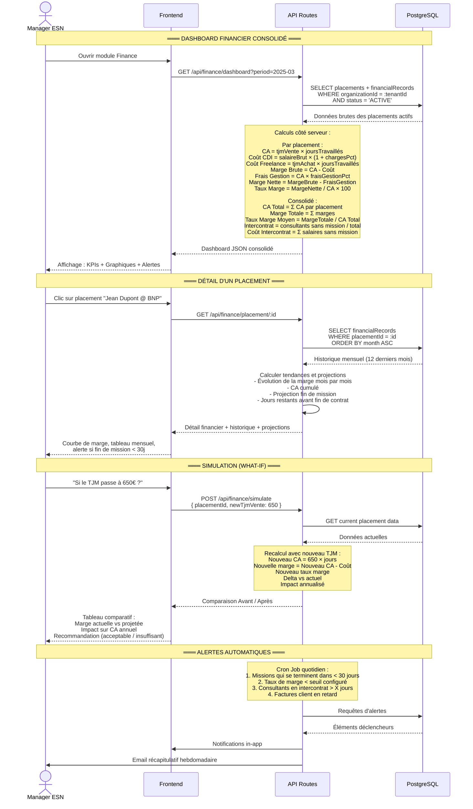

# Financial Calculation

```mermaid
sequenceDiagram
    actor M as Manager ESN
    participant APP as Frontend
    participant API as API Routes
    participant DB as PostgreSQL

    Note over M,DB: ═══ DASHBOARD FINANCIER CONSOLIDÉ ═══

    M->>APP: Ouvrir module Finance
    APP->>API: GET /api/finance/dashboard?period=2025-03

    API->>DB: SELECT placements + financialRecords<br/>WHERE organizationId = :tenantId<br/>AND status = 'ACTIVE'
    DB-->>API: Données brutes des placements actifs

    Note over API: Calculs côté serveur :<br/><br/>Par placement :<br/>  CA = tjmVente × joursTravaillés<br/>  Coût CDI = salaireBrut × (1 + chargesPct)<br/>  Coût Freelance = tjmAchat × joursTravaillés<br/>  Marge Brute = CA - Coût<br/>  Frais Gestion = CA × fraisGestionPct<br/>  Marge Nette = MargeBrute - FraisGestion<br/>  Taux Marge = MargeNette / CA × 100<br/><br/>Consolidé :<br/>  CA Total = Σ CA par placement<br/>  Marge Totale = Σ marges<br/>  Taux Marge Moyen = MargeTotale / CA Total<br/>  Intercontrat = consultants sans mission / total<br/>  Coût Intercontrat = Σ salaires sans mission

    API-->>APP: Dashboard JSON consolidé
    APP-->>M: Affichage : KPIs + Graphiques + Alertes

    Note over M,DB: ═══ DÉTAIL D'UN PLACEMENT ═══

    M->>APP: Clic sur placement "Jean Dupont @ BNP"
    APP->>API: GET /api/finance/placement/:id

    API->>DB: SELECT financialRecords<br/>WHERE placementId = :id<br/>ORDER BY month ASC
    DB-->>API: Historique mensuel (12 derniers mois)

    API->>API: Calculer tendances et projections<br/>- Évolution de la marge mois par mois<br/>- CA cumulé<br/>- Projection fin de mission<br/>- Jours restants avant fin de contrat

    API-->>APP: Détail financier + historique + projections
    APP-->>M: Courbe de marge, tableau mensuel,<br/>alerte si fin de mission < 30j

    Note over M,DB: ═══ SIMULATION (WHAT-IF) ═══

    M->>APP: "Si le TJM passe à 650€ ?"
    APP->>API: POST /api/finance/simulate<br/>{ placementId, newTjmVente: 650 }

    API->>DB: GET current placement data
    DB-->>API: Données actuelles

    Note over API: Recalcul avec nouveau TJM :<br/>  Nouveau CA = 650 × jours<br/>  Nouvelle marge = Nouveau CA - Coût<br/>  Nouveau taux marge<br/>  Delta vs actuel<br/>  Impact annualisé

    API-->>APP: Comparaison Avant / Après
    APP-->>M: Tableau comparatif :<br/>  Marge actuelle vs projetée<br/>  Impact sur CA annuel<br/>  Recommandation (acceptable / insuffisant)

    Note over M,DB: ═══ ALERTES AUTOMATIQUES ═══

    Note over API: Cron Job quotidien :<br/>  1. Missions qui se terminent dans < 30 jours<br/>  2. Taux de marge < seuil configuré<br/>  3. Consultants en intercontrat > X jours<br/>  4. Factures client en retard

    API->>DB: Requêtes d'alertes
    DB-->>API: Éléments déclencheurs
    API->>APP: Notifications in-app
    API->>M: Email récapitulatif hebdomadaire
```
