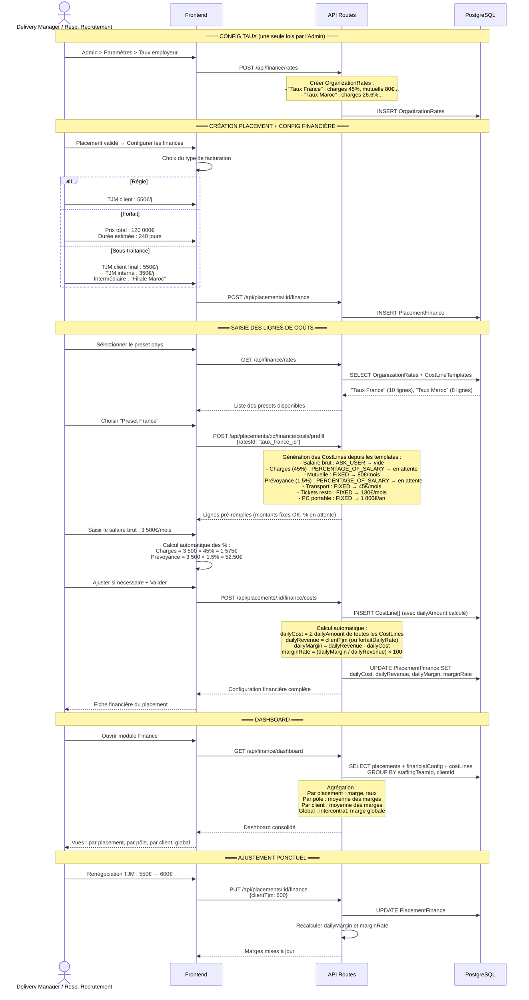

# Financial Calculation

```mermaid
sequenceDiagram
    actor DM as Delivery Manager / Resp. Recrutement
    participant APP as Frontend
    participant API as API Routes
    participant DB as PostgreSQL

    Note over DM,DB: ═══ CONFIG TAUX (une seule fois par l'Admin) ═══

    DM->>APP: Admin > Paramètres > Taux employeur
    APP->>API: POST /api/finance/rates
    Note over API: Créer OrganizationRates :<br/>- "Taux France" : charges 45%, mutuelle 80€...<br/>- "Taux Maroc" : charges 26.6%...
    API->>DB: INSERT OrganizationRates
    
    Note over DM,DB: ═══ CRÉATION PLACEMENT + CONFIG FINANCIÈRE ═══

    DM->>APP: Placement validé → Configurer les finances
    APP->>APP: Choix du type de facturation

    alt Régie
        DM->>APP: TJM client : 550€/j
    else Forfait
        DM->>APP: Prix total : 120 000€<br/>Durée estimée : 240 jours
    else Sous-traitance
        DM->>APP: TJM client final : 550€/j<br/>TJM interne : 350€/j<br/>Intermédiaire : "Filiale Maroc"
    end

    APP->>API: POST /api/placements/:id/finance
    API->>DB: INSERT PlacementFinance

    Note over DM,DB: ═══ SAISIE DES LIGNES DE COÛTS ═══

    DM->>APP: Sélectionner le preset pays
    APP->>API: GET /api/finance/rates
    API->>DB: SELECT OrganizationRates + CostLineTemplates
    DB-->>API: "Taux France" (10 lignes), "Taux Maroc" (8 lignes)
    API-->>APP: Liste des presets disponibles

    DM->>APP: Choisir "Preset France"
    APP->>API: POST /api/placements/:id/finance/costs/prefill<br/>{ratesId: "taux_france_id"}

    Note over API: Génération des CostLines depuis les templates :<br/>- Salaire brut : ASK_USER → vide<br/>- Charges (45%) : PERCENTAGE_OF_SALARY → en attente<br/>- Mutuelle : FIXED → 80€/mois<br/>- Prévoyance (1.5%) : PERCENTAGE_OF_SALARY → en attente<br/>- Transport : FIXED → 45€/mois<br/>- Tickets resto : FIXED → 180€/mois<br/>- PC portable : FIXED → 1 800€/an

    API-->>APP: Lignes pré-remplies (montants fixes OK, % en attente)

    DM->>APP: Saisir le salaire brut : 3 500€/mois
    APP->>APP: Calcul automatique des % :<br/>Charges = 3 500 × 45% = 1 575€<br/>Prévoyance = 3 500 × 1.5% = 52.50€

    DM->>APP: Ajuster si nécessaire + Valider
    APP->>API: POST /api/placements/:id/finance/costs
    API->>DB: INSERT CostLine[] (avec dailyAmount calculé)

    Note over API: Calcul automatique :<br/>dailyCost = Σ dailyAmount de toutes les CostLines<br/>dailyRevenue = clientTjm (ou forfaitDailyRate)<br/>dailyMargin = dailyRevenue - dailyCost<br/>marginRate = (dailyMargin / dailyRevenue) × 100

    API->>DB: UPDATE PlacementFinance SET<br/>dailyCost, dailyRevenue, dailyMargin, marginRate

    API-->>APP: Configuration financière complète
    APP-->>DM: Fiche financière du placement

    Note over DM,DB: ═══ DASHBOARD ═══

    DM->>APP: Ouvrir module Finance
    APP->>API: GET /api/finance/dashboard

    API->>DB: SELECT placements + financialConfig + costLines<br/>GROUP BY staffingTeamId, clientId

    Note over API: Agrégation :<br/>Par placement : marge, taux<br/>Par pôle : moyenne des marges<br/>Par client : moyenne des marges<br/>Global : intercontrat, marge globale

    API-->>APP: Dashboard consolidé
    APP-->>DM: Vues : par placement, par pôle, par client, global

    Note over DM,DB: ═══ AJUSTEMENT PONCTUEL ═══

    DM->>APP: Renégociation TJM : 550€ → 600€
    APP->>API: PUT /api/placements/:id/finance<br/>{clientTjm: 600}
    API->>DB: UPDATE PlacementFinance
    API->>API: Recalculer dailyMargin et marginRate
    API-->>APP: Marges mises à jour
```
