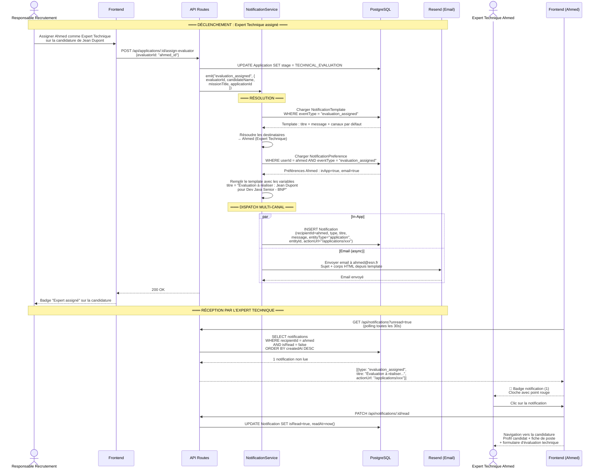
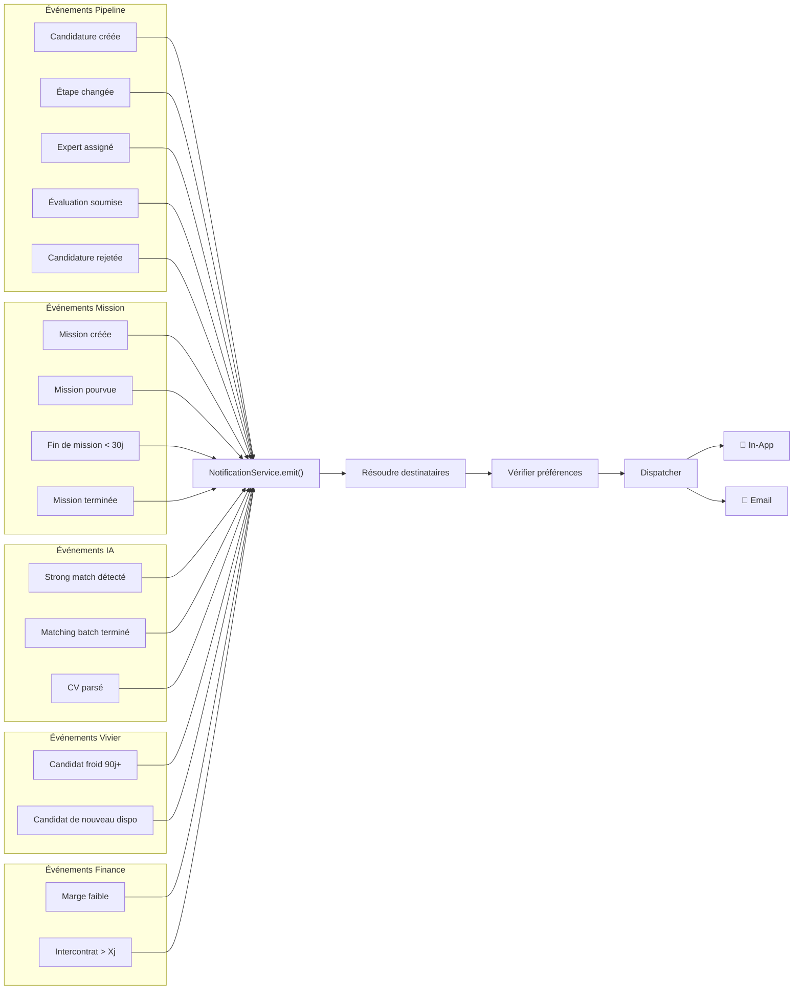

# Notification Dispatch Flow

```mermaid
sequenceDiagram
    actor U as Responsable Recrutement
    participant APP as Frontend
    participant API as API Routes
    participant NS as NotificationService
    participant DB as PostgreSQL
    participant EMAIL as Resend (Email)

    Note over U,EMAIL: ═══ DÉCLENCHEMENT : Expert Technique assigné ═══

    U->>APP: Assigner Ahmed comme Expert Technique<br/>sur la candidature de Jean Dupont
    APP->>API: POST /api/applications/:id/assign-evaluator<br/>{evaluatorId: "ahmed_id"}

    API->>DB: UPDATE Application SET stage = TECHNICAL_EVALUATION
    API->>NS: emit("evaluation_assigned", {<br/>  evaluatorId, candidateName,<br/>  missionTitle, applicationId<br/>})

    Note over NS: ═══ RÉSOLUTION ═══

    NS->>DB: Charger NotificationTemplate<br/>WHERE eventType = "evaluation_assigned"
    DB-->>NS: Template : titre + message + canaux par défaut

    NS->>NS: Résoudre les destinataires<br/>→ Ahmed (Expert Technique)

    NS->>DB: Charger NotificationPreference<br/>WHERE userId = ahmed AND eventType = "evaluation_assigned"
    DB-->>NS: Préférences Ahmed : inApp=true, email=true

    NS->>NS: Remplir le template avec les variables<br/>titre = "Évaluation à réaliser : Jean Dupont<br/>pour Dev Java Senior - BNP"

    Note over NS: ═══ DISPATCH MULTI-CANAL ═══

    par In-App
        NS->>DB: INSERT Notification<br/>(recipientId=ahmed, type, titre,<br/>message, entityType="application",<br/>entityId, actionUrl="/applications/xxx")
    and Email (async)
        NS->>EMAIL: Envoyer email à ahmed@esn.fr<br/>Sujet + corps HTML depuis template
        EMAIL-->>NS: Email envoyé
    end

    API-->>APP: 200 OK
    APP-->>U: Badge "Expert assigné" sur la candidature

    Note over U,EMAIL: ═══ RÉCEPTION PAR L'EXPERT TECHNIQUE ═══

    actor E as Expert Technique Ahmed
    participant APP2 as Frontend (Ahmed)

    APP2->>API: GET /api/notifications?unread=true<br/>(polling toutes les 30s)
    API->>DB: SELECT notifications<br/>WHERE recipientId = ahmed<br/>AND isRead = false<br/>ORDER BY createdAt DESC
    DB-->>API: 1 notification non lue

    API-->>APP2: [{type: "evaluation_assigned",<br/>titre: "Évaluation à réaliser...",<br/>actionUrl: "/applications/xxx"}]

    APP2-->>E: 🔔 Badge notification (1)<br/>Cloche avec point rouge

    E->>APP2: Clic sur la notification
    APP2->>API: PATCH /api/notifications/:id/read
    API->>DB: UPDATE Notification SET isRead=true, readAt=now()

    APP2-->>E: Navigation vers la candidature<br/>Profil candidat + fiche de poste<br/>+ formulaire d'évaluation technique
```

## Événements déclencheurs principaux

```mermaid
graph LR
    subgraph "Événements Pipeline"
        E1["Candidature créée"]
        E2["Étape changée"]
        E3["Expert assigné"]
        E4["Évaluation soumise"]
        E5["Candidature rejetée"]
    end

    subgraph "Événements Mission"
        E6["Mission créée"]
        E7["Mission pourvue"]
        E8["Fin de mission < 30j"]
        E9["Mission terminée"]
    end

    subgraph "Événements IA"
        E10["Strong match détecté"]
        E11["Matching batch terminé"]
        E12["CV parsé"]
    end

    subgraph "Événements Vivier"
        E13["Candidat froid 90j+"]
        E14["Candidat de nouveau dispo"]
    end

    subgraph "Événements Finance"
        E15["Marge faible"]
        E16["Intercontrat > Xj"]
    end

    NS["NotificationService.emit()"]

    E1 & E2 & E3 & E4 & E5 --> NS
    E6 & E7 & E8 & E9 --> NS
    E10 & E11 & E12 --> NS
    E13 & E14 --> NS
    E15 & E16 --> NS

    NS --> RESOLVE["Résoudre destinataires"]
    RESOLVE --> PREFS["Vérifier préférences"]
    PREFS --> DISPATCH["Dispatcher"]
    DISPATCH --> INAPP["🔔 In-App"]
    DISPATCH --> EMAILC["📧 Email"]
```
