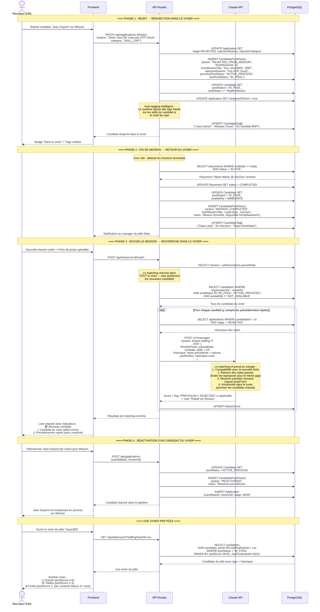

# Talent Pool — Vivier de Candidats

```mermaid
sequenceDiagram
    actor R as Recruteur ESN
    participant APP as Frontend
    participant API as API Routes
    participant AI as Claude API
    participant DB as PostgreSQL

    Note over R,DB: ═══ PHASE 1 : REJET → RÉINJECTION DANS LE VIVIER ═══

    R->>APP: Rejeter candidat "Jean Dupont" sur Mission #42
    APP->>API: PATCH /api/applications/:id/reject<br/>{reason: "Stack Java OK mais pas d'XP Cloud",<br/>category: "SKILL_GAP"}

    API->>DB: UPDATE Application SET<br/>stage=REJECTED, rejectionReason, rejectionCategory

    API->>DB: INSERT CandidatePoolHistory<br/>{action: "REJECTED_FROM_MISSION",<br/>fromMissionId: 42,<br/>fromMissionTitle: "Dev Java/AWS - BNP",<br/>rejectionReason: "Pas d'XP Cloud",<br/>previousPoolStatus: "ACTIVE_PROCESS",<br/>newPoolStatus: "IN_POOL"}

    API->>DB: UPDATE Candidate SET<br/>poolStatus = IN_POOL,<br/>poolNotes += "Rejeté Mission #42: bon Java, manque Cloud"

    API->>DB: UPDATE Application SET reinjectedToPool = true

    Note over API: Auto-tagging intelligent :<br/>Le système ajoute des tags basés<br/>sur les skills du candidat et<br/>le motif de rejet

    API->>DB: UPSERT CandidateTag[]<br/>["Java Senior", "Manque Cloud", "Ex-candidat BNP"]

    API-->>APP: Candidat réinjecté dans le vivier
    APP-->>R: Badge "Dans le vivier" + Tags visibles

    Note over R,DB: ═══ PHASE 2 : FIN DE MISSION → RETOUR AU VIVIER ═══

    Note over API: Cron Job : détecte les missions terminées

    API->>DB: SELECT placements WHERE endDate <= today<br/>AND status = 'ACTIVE'
    DB-->>API: Placement "Marie Martin @ SocGen" terminé

    API->>DB: UPDATE Placement SET status = COMPLETED
    API->>DB: UPDATE Candidate SET<br/>poolStatus = IN_POOL,<br/>availability = IMMEDIATE

    API->>DB: INSERT CandidatePoolHistory<br/>{action: "MISSION_COMPLETED",<br/>fromMissionTitle: "Lead Data - SocGen",<br/>notes: "Mission terminée, disponible immédiatement"}

    API->>DB: UPSERT CandidateTag[]<br/>["Data Lead", "Ex-SocGen", "Dispo immédiate"]

    API-->>APP: Notification au manager du pôle Data

    Note over R,DB: ═══ PHASE 3 : NOUVELLE MISSION → RECHERCHE DANS LE VIVIER ═══

    R->>APP: Nouvelle mission créée + Fiche de poste uploadée
    APP->>API: POST /api/missions/:id/match

    API->>DB: SELECT mission + jobDescription.parsedData

    Note over API: Le matching cherche dans<br/>TOUT le vivier — pas seulement<br/>les nouveaux candidats

    API->>DB: SELECT candidates WHERE<br/>organizationId = :tenantId<br/>AND poolStatus IN ('IN_POOL', 'ACTIVE_PROCESS')<br/>AND availability != 'NOT_AVAILABLE'
    DB-->>API: Tous les candidats du vivier

    loop Pour chaque candidat (y compris les précédemment rejetés)
        API->>DB: SELECT applications WHERE candidateId = :id<br/>AND stage = 'REJECTED'
        DB-->>API: Historique des rejets

        API->>AI: POST /v1/messages<br/>System: Expert staffing IT<br/>User: {<br/>  ficheDePoste: parsedData,<br/>  candidat: skills + XP,<br/>  historique: rejets précédents + raisons,<br/>  poolHistory: historique vivier<br/>}

        Note over AI: Le matching IA prend en compte :<br/>1. Compatibilité avec la nouvelle fiche<br/>2. Raisons des rejets passés<br/>   (éviter de reproposer pour le même gap)<br/>3. Missions passées réussies<br/>   (signal positif fort)<br/>4. Ancienneté dans le vivier<br/>   (prioriser les candidats chauds)

        AI-->>API: Score + flag "PREVIOUSLY_REJECTED" si applicable<br/>+ note "Rejeté sur Mission #42 pour manque Cloud,<br/>mais cette mission ne requiert pas Cloud"
        API->>DB: UPSERT MatchScore
    end

    API-->>APP: Résultats de matching enrichis
    APP-->>R: Liste classée avec indicateurs :<br/>🟢 Nouveau candidat<br/>🔄 Candidat du vivier (déjà connu)<br/>⚠️ Précédemment rejeté (avec contexte)

    Note over R,DB: ═══ PHASE 4 : RÉACTIVATION D'UN CANDIDAT DU VIVIER ═══

    R->>APP: Sélectionner Jean Dupont (du vivier) pour Mission #58
    APP->>API: POST /api/applications<br/>{candidateId, missionId}

    API->>DB: UPDATE Candidate SET<br/>poolStatus = ACTIVE_PROCESS

    API->>DB: INSERT CandidatePoolHistory<br/>{action: "REACTIVATED",<br/>notes: "Réactivé pour Mission #58 - Dev Java Spring"}

    API->>DB: INSERT Application<br/>{candidateId, missionId, stage: NEW}

    API-->>APP: Candidat réactivé dans le pipeline
    APP-->>R: Jean Dupont est maintenant en process<br/>sur Mission #58 avec son historique visible

    Note over R,DB: ═══ VUE VIVIER PAR PÔLE ═══

    R->>APP: Ouvrir le vivier du pôle "Java/JEE"
    APP->>API: GET /api/talent-pool?staffingTeamId=xxx

    API->>DB: SELECT candidates<br/>JOIN candidate_pools ON staffingTeamId = xxx<br/>WHERE poolStatus = 'IN_POOL'<br/>ORDER BY poolScore DESC, lastContactedAt DESC
    DB-->>API: Candidats du pôle avec tags + historique

    API-->>APP: Vue vivier du pôle
    APP-->>R: Kanban vivier :<br/>🔥 Chauds (poolScore 4-5)<br/>🟡 Tièdes (poolScore 2-3)<br/>❄️ Froids (poolScore 1, pas contacté depuis 3+ mois)
```
