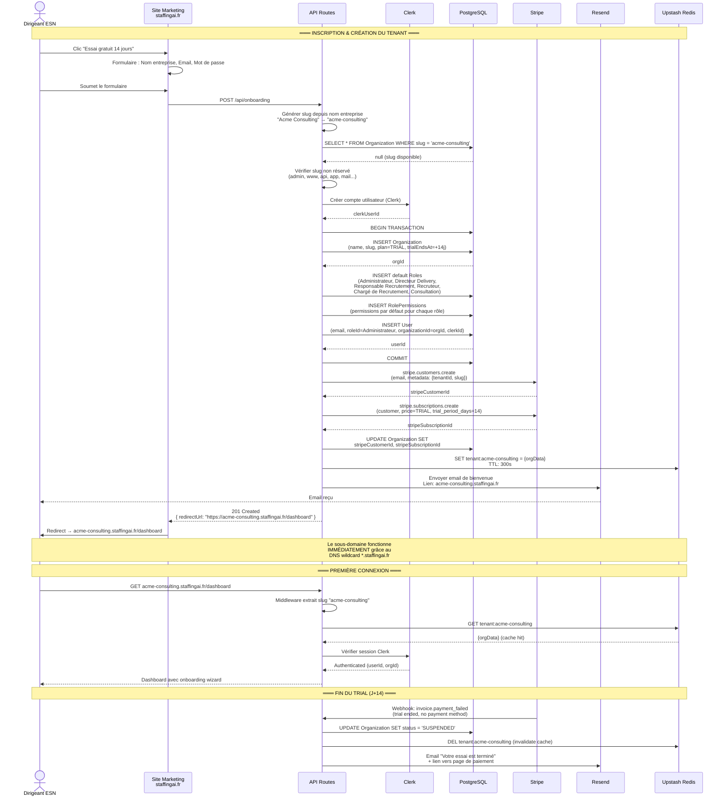

# Tenant Onboarding

```mermaid
sequenceDiagram
    actor ESN as Dirigeant ESN
    participant SITE as Site Marketing<br/>staffingai.fr
    participant API as API Routes
    participant AUTH as Clerk
    participant DB as PostgreSQL
    participant STRIPE as Stripe
    participant MAIL as Resend
    participant REDIS as Upstash Redis

    Note over ESN,REDIS: ═══ INSCRIPTION & CRÉATION DU TENANT ═══

    ESN->>SITE: Clic "Essai gratuit 14 jours"
    SITE->>SITE: Formulaire : Nom entreprise, Email, Mot de passe
    ESN->>SITE: Soumet le formulaire
    SITE->>API: POST /api/onboarding

    API->>API: Générer slug depuis nom entreprise<br/>"Acme Consulting" → "acme-consulting"
    API->>DB: SELECT * FROM Organization WHERE slug = 'acme-consulting'
    DB-->>API: null (slug disponible)

    API->>API: Vérifier slug non réservé<br/>(admin, www, api, app, mail...)

    API->>AUTH: Créer compte utilisateur (Clerk)
    AUTH-->>API: clerkUserId

    API->>DB: BEGIN TRANSACTION
    API->>DB: INSERT Organization<br/>(name, slug, plan=TRIAL, trialEndsAt=+14j)
    DB-->>API: orgId
    API->>DB: INSERT default Roles<br/>(Administrateur, Directeur Delivery,<br/>Responsable Recrutement, Recruteur,<br/>Chargé de Recrutement, Consultation)
    API->>DB: INSERT RolePermissions<br/>(permissions par défaut pour chaque rôle)
    API->>DB: INSERT User<br/>(email, roleId=Administrateur, organizationId=orgId, clerkId)
    DB-->>API: userId
    API->>DB: COMMIT

    API->>STRIPE: stripe.customers.create<br/>(email, metadata: {tenantId, slug})
    STRIPE-->>API: stripeCustomerId

    API->>STRIPE: stripe.subscriptions.create<br/>(customer, price=TRIAL, trial_period_days=14)
    STRIPE-->>API: stripeSubscriptionId

    API->>DB: UPDATE Organization SET<br/>stripeCustomerId, stripeSubscriptionId
    
    API->>REDIS: SET tenant:acme-consulting = {orgData}<br/>TTL: 300s
    
    API->>MAIL: Envoyer email de bienvenue<br/>Lien: acme-consulting.staffingai.fr
    MAIL-->>ESN: Email reçu

    API-->>SITE: 201 Created<br/>{ redirectUrl: "https://acme-consulting.staffingai.fr/dashboard" }

    SITE->>ESN: Redirect → acme-consulting.staffingai.fr/dashboard

    Note over ESN,REDIS: Le sous-domaine fonctionne<br/>IMMÉDIATEMENT grâce au<br/>DNS wildcard *.staffingai.fr

    Note over ESN,REDIS: ═══ PREMIÈRE CONNEXION ═══

    ESN->>API: GET acme-consulting.staffingai.fr/dashboard
    API->>API: Middleware extrait slug "acme-consulting"
    API->>REDIS: GET tenant:acme-consulting
    REDIS-->>API: {orgData} (cache hit)
    API->>AUTH: Vérifier session Clerk
    AUTH-->>API: Authenticated (userId, orgId)
    API-->>ESN: Dashboard avec onboarding wizard

    Note over ESN,REDIS: ═══ FIN DU TRIAL (J+14) ═══

    STRIPE->>API: Webhook: invoice.payment_failed<br/>(trial ended, no payment method)
    API->>DB: UPDATE Organization SET status = 'SUSPENDED'
    API->>REDIS: DEL tenant:acme-consulting (invalidate cache)
    API->>MAIL: Email "Votre essai est terminé"<br/>+ lien vers page de paiement
```
