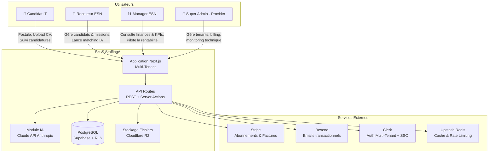

# Context

```mermaid
graph TB
    subgraph Utilisateurs
        C["👤 Candidat IT"]
        R["👔 Recruteur ESN"]
        M["📊 Manager ESN"]
        SA["🔐 Super Admin - Provider"]
    end

    subgraph "SaaS StaffingAI"
        APP["Application Next.js<br/>Multi-Tenant"]
        API["API Routes<br/>REST + Server Actions"]
        AI["Module IA<br/>Claude API Anthropic"]
        DB[("PostgreSQL<br/>Supabase + RLS")]
        STORAGE["Stockage Fichiers<br/>Cloudflare R2"]
    end

    subgraph "Services Externes"
        STRIPE["Stripe<br/>Abonnements & Factures"]
        EMAIL["Resend<br/>Emails transactionnels"]
        AUTH["Clerk<br/>Auth Multi-Tenant + SSO"]
        REDIS["Upstash Redis<br/>Cache & Rate Limiting"]
    end

    C -->|"Postule, Upload CV,<br/>Suivi candidatures"| APP
    R -->|"Gère candidats & missions,<br/>Lance matching IA"| APP
    M -->|"Consulte finances & KPIs,<br/>Pilote la rentabilité"| APP
    SA -->|"Gère tenants, billing,<br/>monitoring technique"| APP

    APP --> API
    API --> AI
    API --> DB
    API --> STORAGE
    API --> STRIPE
    API --> EMAIL
    API --> AUTH
    API --> REDIS
```
